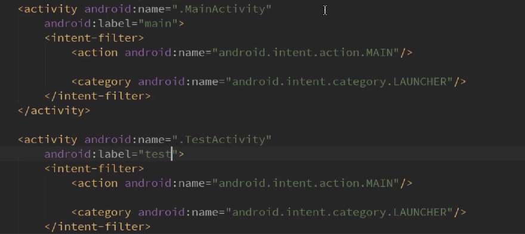
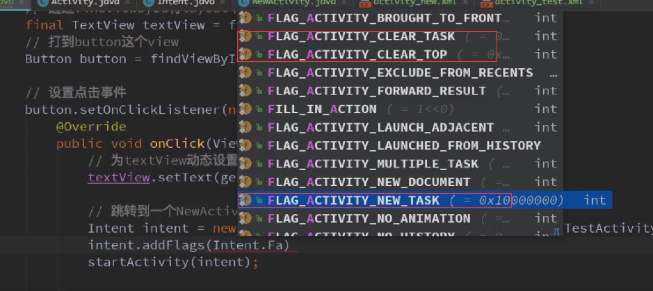

# 创建

step1 创建类继承自AppCompactActivity

step2 在manifest中注册

可以直接在类中利用快捷键进行注册

也可以在manifest文件中注册

tips activity内部有intent-filter代表主入口,可以让多个activity都有主入口的intent-filter,系统中会有两个入口指向同一个app

# 四种启动模式

**设置启动模式:**

method1 在manifest中设置launchMode属性

method2 代码设置

- CLEAR_TASK代表清除栈
- CLEAR_TOP代表清除栈顶
- NEW_TASK代表创建新栈

**标准启动模式(standard)(默认)**


**顶部复用模式(singleTop)**

防止用户多次点击导致同一个activity在顶部多次重复


**单一任务模式(singleTask)**


**单例模式(singleInstance )**


# 生命周期


例子:

- 正常启动:onCreate -> onStart -> onResume；正常退出:onPause -> onStop -> onDestory
- 已经处于前台的Activity,点击主页按钮离开当前Activity:onPause -> onStop；回到Activity:onRestart -> onStart -> onResume
- Activity不可操作(如:息屏、打开了其他Activity,而应用被强行杀死了),再回到Activity:onCreate -> onStart -> onResume
- 当启动另一个Activity时,当前Activity:onPause -> onStop,当点击返回按钮使另一个Activity退出时,当前Activity:onRestart -> onStart -> onResume,当前Activity回调onPause后便会开始SecondActivity的启动操作
- 普通对话框对生命周期没有任何影响
- 如果有个Activity伪装成对话框模式,那么它启动时,之前的Activity:onPause,"对话框"消失后,onResume再次回到前台

注意事项:
不要在MainActivity的onPause()中做耗时操作,可以把处理放到onStop,否则会影响SecondActivity的启动速度

# 四种状态

**1. 活动（Active/Running）状态**

当Activity运行在屏幕前台(处于当前任务活动栈的最上面),此时它获取了焦点能响应用户的操作,属于运行状态，同一个时刻只会有一个Activity 处于活动(Active)或运行(Running)状态。

此状态由onResume()进入，由onPause()退出

**2. 暂停(Paused)状态**

当Activity失去焦点(如在它之上有另一个透明的Activity或返回桌面)它将处于暂停, 再进而进入其他状态。暂停的Activity仍然是存活状态(它保留着所有的状态和成员信息并保持和窗口管理器的连接),但是当系统内存极小时可以被系统杀掉。Android7.0后, 多窗口模式下失去焦点的Activity也将进入onPause，但这不意味着Activity中的活动(动画、视频)等会暂停。虽然官方文档使用的是"an activity is going into the background" 来描述，但这不意味着一个Toast或者由本Activity创建的Dialog会调用onPause。结合[这里](https://hit-alibaba.github.io/interview/Android/basic/Android-LaunchMode.html)对Activity的栈机制不难理解，只要当前Activity仍处于栈顶，系统就默认其仍处于活跃状态。

此状态由onPause()进入，可能下一步进入onResume()或者onCreate()重新唤醒软件，或者被onStop()杀掉

**3. 停止(Stopped)状态**

完全被另一个Activity遮挡时处于停止状态,它仍然保留着所有的状态和成员信息。只是对用户不可见,当其他地方需要内存时它往往被系统杀掉。

该状态由onStop()进入，如果被杀掉，可能进入onCreate()或onRestart()，如果彻底死亡，进入onDestroy()

# Activity启动方式

**显式启动**


**隐式启动**

**①启动系统Activity**


**②启动普通Activity**


**③startActivityForResult**


# 传递内容

## **使用Intent的putExtra传递**

第一个Activity中

```java
//创建意图对象
 Intent intent = new Intent(this,TwoActivity.class);
 //设置传递键值对
 intent.putExtra("data",str);
 //激活意图
 startActivity(intent);
```

第二个Activity中

```java
// 获取意图对象
 Intent intent = getIntent();
 //获取传递的值
 String str = intent.getStringExtra("data");
 //设置值
 tv.setText(str);
```

## **使用Intent的Bundle传递**

第一个Activity中

```java
//创建意图对象
 Intent intent = new Intent(MainActivity.this,TwoActivity.class);
 //用数据捆传递数据
 Bundle bundle = new Bundle();
 bundle.putString("data", str);
 //把数据捆设置改意图
 intent.putExtra("bun", bundle);
 //激活意图
 startActivity(intent);
```

第二个Activity

```java
//获取Bundle
 Intent intent = getIntent();
 Bundle bundle = intent.getBundleExtra("bun");
 String str = bundle.getString("data");
 tv.setText(str);
```

## **使用Activity销毁时传递数据**

第一个Activity中

```java
  Intent intent = new Intent(MainActivity.this,TwoActivity.class);
  //用一种特殊方式开启Activity
 startActivityForResult(intent, 11);
//设置数据

protected void onActivityResult(int requestCode, int resultCode, Intent data) {
 super.onActivityResult(requestCode, resultCode, data);
 String str = data.getStringExtra("data");
 tvOne.setText(str);
}
```

第二个activity中

```java
//设置返回的数据
 Intent intent = new Intent();
 intent.putExtra("data", edtOne.getText().toString().trim());
 setResult(3, intent);
 //关闭当前activity
 finish();
```

## **使用序列化对象Seriazable**

工具类

```java
import java.io.Serializable;
class DataBean implements Serializable {
 private String name;
 private String sex;
 public String getName() {
 return name;
 }
 public void setName(String name) {
 this.name = name;
 }
 public String getSex() {
 return sex;
 }
 public void setSex(String sex) {
 this.sex = sex;
 }
}
```

第一个Activity

```java
//创建意图
 Intent intent = new Intent(MainActivity.this,TwoActivity.class);
 DataBean bean = new DataBean();
 //通过set方法把数据保存到DataBean对象中
 bean.setName("啦啦");
 bean.setSex("男");
 intent.putExtra("key", bean);
 startActivity(intent);
```

第二个Activity

```java
Intent intent = getIntent();
 //反序列化数据对象
 Serializable se = intent.getSerializableExtra("key");
 if(se instanceof DataBean){
  //获取到携带数据的DataBean对象db
  DataBean db = (DataBean) se;
  tv.setText(db.getName()+"==="+db.getSex());
 }
```

## **使用静态变量传递数据**

第一个Activity

```java
Intent intent = new Intent(MainActivity.this,TwoActivity.class);
TwoActivity.name="牛逼";
TwoActivity.str="你说";
startActivity(intent);
```

第二个Activity

```java
//静态变量
protected static String name;
protected static String str;
tv.setText(str+name);
```

# 注意

## AppCompatActivity和Activity的区别

AppcompaActivity相对于Activity的主要的两点变化；
1：主界面带有toolbar的标题栏；
2：theme主题只能用android:theme=”@style/AppTheme （appTheme主题或者其子类），而不能用android:style。 否则会提示错误： Caused by: java.lang.IllegalStateException: You need to use a Theme.AppCompat theme (or descendant) with this activity.

https://blog.csdn.net/today_work/article/details/79300181