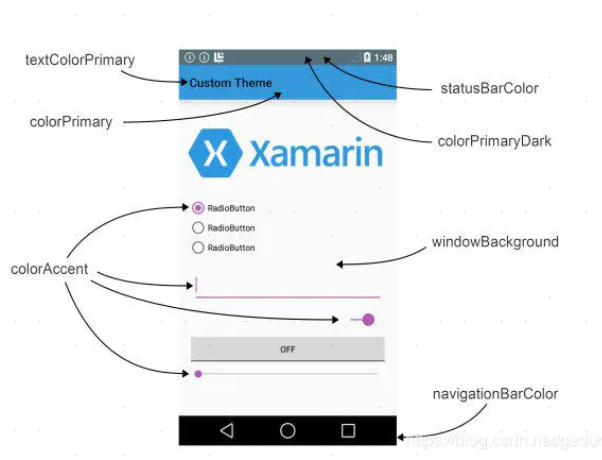

# 背景

## 发展历史


## 系统

### SDK与NDK

SDK：Software Development Kit，软件开发工具包
NDK：Native Development Kit，Android原生工具开发包

### 安卓系统架构

## API级别和版本号

https://source.android.com/setup/start/build-numbers

# Android系统架构

总的来说，Android的系统体系结构分为**四层**，自顶向下分别是：

- 应用程序(Applications)
- 应用程序框架(Application Frameworks)
- 系统运行库与Android运行环境(Libraris & Android Runtime)
- Linux内核(Linux Kernel)

*安卓系统结构示意图*


下面对每层进行详细说明

## 1. 应用程序(Applications)

Android会同一系列核心应用程序包一起发布，该应用程序包包括email客户端，SMS短消息程序，日历，地图，浏览器，联系人管理程序等。所有的应用程序都是使用JAVA语言编写的。通常开发人员就处在这一层。

## 2. 应用程序框架(Application Frameworks)

提供应用程序开发的各种API进行快速开发，也即隐藏在每个应用后面的是一系列的服务和系统，大部分使用Java编写，所谓官方源码很多也就是看这里，其中包括：

- 丰富而又可扩展的视图（Views），可以用来构建应用程序， 它包括列表（lists），网格（grids），文本框（text boxes），按钮（buttons）， 甚至可嵌入的web浏览器。
- 内容提供器（Content Providers）使得应用程序可以访问另一个应用程序的数据（如联系人数据库）， 或者共享它们自己的数据
- 资源管理器（Resource Manager）提供 非代码资源的访问，如本地字符串，图形，和布局文件（ layout files ）。
- 通知管理器 （Notification Manager） 使得应用程序可以在状态栏中显示自定义的提示信息。
- 活动管理器（ Activity Manager） 用来管理应用程序生命周期并提供常用的导航回退功能。

## 3. 系统运行库与Android运行环境(Libraris & Android Runtime)

### 1) 系统运行库

Android 包含一些C/C++库，这些库能被Android系统中不同的组件使用。它们通过 Android 应用程序框架为开发者提供服务。以下是一些核心库：

- **Bionic系统 C 库** - 一个从 BSD 继承来的标准 C 系统函数库（ libc ）， 它是专门为基于 embedded linux 的设备定制的。
- **媒体库** - 基于 PacketVideo OpenCORE；该库支持多种常用的音频、视频格式回放和录制，同时支持静态图像文件。编码格式包括MPEG4, H.264, MP3, AAC, AMR, JPG, PNG 。
- **Surface Manager** - 对显示子系统的管理，并且为多个应用程序提 供了2D和3D图层的无缝融合。这部分代码
- **Webkit,LibWebCore** - 一个最新的web浏览器引擎用，支持Android浏览器和一个可嵌入的web视图。鼎鼎大名的 Apple Safari背后的引擎就是Webkit
- **SGL** - 底层的2D图形引擎
- **3D libraries** - 基于OpenGL ES 1.0 APIs实现；该库可以使用硬件 3D加速（如果可用）或者使用高度优化的3D软加速。
- **FreeType** -位图（bitmap）和矢量（vector）字体显示。
- **SQLite** - 一个对于所有应用程序可用，功能强劲的轻型关系型数据库引擎。
- 还有部分上面没有显示出来的就是硬件抽象层。其实Android并非讲所有的设备驱动都放在linux内核里面，而是实现在userspace空间，这么做的主要原因是GPL协议，Linux是遵循该 协议来发布的，也就意味着对 linux内核的任何修改，都必须发布其源代码。而现在这么做就可以避开而无需发布其源代码，毕竟它是用来赚钱的。 而 在linux内核中为这些userspace驱动代码开一个后门，就可以让本来userspace驱动不可以直接控制的硬件可以被访问。而只需要公布这个 后门代码即可。一般情况下如果要将Android移植到其他硬件去运行，只需要实现这部分代码即可。包括：显示器驱动，声音，相机，GPS,GSM等等

### 2) Android运行环境

该核心库提供了JAVA编程语言核心库的大多数功能。
每一个Android应用程序都在它自己的进程中运 行，都拥有一个独立的Dalvik虚拟 机实例。Dalvik被设计成一个设备可以同时高效地运行多个虚拟系统。 Dalvik虚拟机执行（.dex）的Dalvik可执行文件，该格式文件针对小内存使用做了 优化。同时虚拟机是基于寄存器的，所有的类都经由JAVA编译器编译，然后通过SDK中 的 "dx" 工具转化成.dex格式由虚拟机执行。

## 4. Linux内核(Linux Kernel)

Android的核心系统服务依赖于Linux 2.6 内核，如安全性，内存管理，进程管理， 网络协议栈和驱动模型。 Linux 内核也同时作为硬件和软件栈之间的抽象层。其外还对其做了部分修改，主要涉及两部分修改：

1. Binder (IPC)：提供有效的进程间通信，虽然linux内核本身已经提供了这些功能，但Android系统很多服务都需要用到该功能，为了某种原因其实现了自己的一套。
2. 电源管理：主要是为了省电，毕竟是手持设备嘛，低耗电才是我们的追求。

注:最后附上原博连接[懒虫一个V：android系统体系结构](http://blog.csdn.net/spy19881201/article/details/5775484)，关于谷歌Android源码的目录结构并未一并贴出可在原博查阅

### Dalvik

Dalvik是Google公司设计的，用于在Android平台上运行的虚拟机，其指令售用于寄存器架构，执行其特有的dex文件来完成对象生命周期管理、堆栈管理、线程管理、安全异常管理、垃圾回收等重要功能。每一个Android应用在底层都会对应一个独立的Dalvik虚拟机实例，其代码在虚拟机的解释下得以执行，Dalvik虚拟机编译文件的过程如下图所示。


### Android版本


- Gingerbread 号称最稳定 手机届的xp系统
- honeycomb  平板
- 4.0 手机平板兼容 默认的 比较流行的

### Android应用领域


# AndroidStudio

## 目录结构

jnu.text(androidTest) 和 jnu.text(test)的产生


cmd下启动使用模拟器


先运行一次程序才能找到R文件


## 快捷键

| 快捷键          | 用途               |
| --------------- | ------------------ |
|                 |                    |
| Ctrl+Alt+(空格) | 提示化代码         |
| Alt+F           | 格式化代码(自定义) |
| Ctrl+Q          | 显示文档说明       |
| Ctrl+Shift+F    | 全局搜索字符       |
| Ctrl+F          | 查找               |
| Ctrl+Alt+C      | 抽取字符串为常量   |
| Ctrl+Alt+M      | 提取方法           |
| Ctrl+Alt+F      | 提取全局变量       |

## 注意

**修改工程名称及修改包名**

<https://blog.csdn.net/u012693479/article/details/107233954>

**查找库**

File > Project Structure


然后就可以搜索了


**将本机文件导入到手机**


**打开模块设置**


**Gradle SDK Java AndroidStudio的历史版本查看下载**

https://www.jianshu.com/p/f7eca878b8d7


# 权限

## 动态权限申请

step1 检查是否具有权限


step2 请求权限（可以一次性请求多个）


step3 检查权限请求返回代码


# Navigation导航

https://juejin.cn/post/6898234461361307655


# Application


**作用**

Application对象全局可访问，且全程陪同应用进程。所以特别适合完成以下任务:

共享全局状态

初始化全应用所需的服务

**回调函数**

Application对象由Android系统管理，它的回调函数都运行于U线程。

onCreate

onConfigurationChanged

比如语言变更和屏幕方向改变

onLowMemory

Application对象vs.静态单例

静态单例模块化程度更好

Application就是一个context，所以有访问资源的能力>静态单例可以接受context参数

Application对象能接收系统回调，自动知悉系统环境变化> Application对象的生命周期由系统控制

如果单例能实现需求就用单例

# 四大组件

Android四大组件其实就是在AndroidManifest.xml里的在application下记录的标签

android:exported属性代表这个组件能否被其他应用调用，true时可以，false不行；当有intent-filter时默认为true，没有时默认为false

## Service

没有界面的activity

用于在后台处理耗时操作（下载、音乐播放）

不受activity生命周期的影响


其它应用中使用服务


# AIDL

全称：Android Interface definition language

作用：进程间通信接口

使用：

1.创建AIDL文件


2.自动生成对应的Java文件


3.在service的onBind()方法中返回IMyAidInterface.Stub()


4.在Activity的ServiceConnection里获得接口对象


# 视图

## 主题与风格(Style&Theme)

**主题与风格的联系与区别**

- style和theme:是一个包含一种 或者 多种格式化 属性 的集合 ,并且 style和theme都是资源,存放在res/values 文件夹下。
- style:View级别的,只能在某个Activity的布局文件中使用  
- Theme:应用级别的,你必须在AndroidManifest.xml中的\<application>"或者\<activity>中使用

**在定义Theme的时候@符号和?符号的区别**

@符号表明我们引用的资源是前边定义过的(或者在前一个项目中或者在Android 框架中)。问号？表明 我们引用的资源的值在当前的主题当中定义过

**通过代码给一个Activity设置主题**

```java
protected void onCreate(Bundle savedInstanceState) {
     super.onCreate(savedInstanceState); 
     setTheme(android.R.style.Theme_Light); 
     setContentView(R.layout.linear_layout_3); 
}
```

**AppTheme主题颜色**

*1.colorPrimary*

App Bar 的背景色,即 ActionBar,通常也是一个 App 的主题色调。不过 ActionBar 已经退出历史舞台,由 Toolbar 代替使用,但是 Toolbar 需要在 layout 文件中单独使用 background 属性设置背景色,如:

```java
<android.support.v7.widget.Toolbar
  android:layout_width="match_parent"
  android:layout_height="wrap_content"
  android:background="?attr/colorPrimary" />
```

*2.colorPrimaryDark*

status bar(状态栏)背景色。仅作用于 Lollipop 及更高版本。

*colorAccent*

许多控件在选中状态或获取焦点状态下使用这个颜色,常见有:

- CheckBox:checked 状态
- RadioButton:checked 状态
- SwitchCompat:checked 状态
- EditText:获取焦点时的 underline 和 cursor 颜色
- TextInputLayout:悬浮 label 字体颜色

**android:navigationBarColor**

navigation bar 背景色。仅作用于 Lollipop 及更高版本。

**colorControlNormal**

某些 Views "normal" 状态下的颜色,常见如:unselected CheckBox 和 RadioButton,失去焦点时的 EditText,Toolbar 溢出按钮颜色,等等。

**colorControlActivated**

某种程度上,是 colorAccent 的替代者,比如对于 CheckBox 和 RadioButton 的 checked 状态,colorControlActivated 属性会覆盖 colorAccent 属性的对应颜色。

**colorControlHighlight**

所有可点击 Views 触摸状态下的 Ripple(涟漪)效果。仅作用于 Lollipop 及更高版本。

**colorButtonNormal**

Button normal 状态下的背景色。注意,这种设置与 Button 的 android:background 属性改变背景色不同的是,前者在 Lollipop 及更高版本上会让 Button 依旧保持阴影和 Ripple 触摸效果。

**android:windowBackground**

窗口背景色,诸如此类的还有:android:background,android:colorBackground 等。

**android:textColorPrimary**

EditText 的 text color,等等文本颜色。

**navigationIcon**

返回按钮的图片




**常见的主题与风格**

android:theme="@android:style/Theme.Dialog" 将一个Activity显示为能话框模式  
android:theme="@android:style/Theme.NoTitleBar" 不显示应用程序标题栏  
android:theme="@android:style/Theme.NoTitleBar.Fullscreen" 不显示应用程序标题栏,并全屏
android:theme="Theme.Light" 背景为白色  
android:theme="Theme.Light.NoTitleBar" 白色背景并无标题栏  
android:theme="Theme.Light.NoTitleBar.Fullscreen" 白色背景,无标题栏,全屏  
android:theme="Theme.Black" 背景黑色  
android:theme="Theme.Black.NoTitleBar" 黑色背景并无标题栏  
android:theme="Theme.Black.NoTitleBar.Fullscreen" 黑色背景,无标题栏,全屏  
android:theme="Theme.Wallpaper" 用系统桌面为应用程序背景  
android:theme="Theme.Wallpaper.NoTitleBar" 用系统桌面为应用程序背景,且无标题栏  
android:theme="Theme.Wallpaper.NoTitleBar.Fullscreen" 用系统桌面为应用程序背景,无标题栏,全屏
android:theme="Translucent" 半透明  
android:theme="Theme.Translucent.NoTitleBar" 半透明、无标题栏  
android:theme="Theme.Translucent.NoTitleBar.Fullscreen" 半透明、无标题栏、全屏  
android:theme="Theme.Panel"  
android:theme="Theme.Light.Panel"


**ThemeOverlay使用特点**

当在某个Activity有些特殊要求的时候就可以用ThemeOverlay继承全局的样式,来修改自己的个性化样式,注意了该样式的引用只能设置在布局文件上,不能在清单文件里面进行设置 
定义:

```xml
<style name="AppTheme.Secondary" parent="ThemeOverlay.AppCompat">
    <item name="colorAccent">@color/colorPrimary</item>
</style>
```

调用:

```xml
    android:background="@color/dark_background"
    android:theme="@style/ThemeOverlay.AppCompat.Dark">
```

单独给toolbar设置样式

```xml
<android.support.v7.widget.Toolbar xmlns:android="http://schemas.android.com/apk/res/android"
    android:layout_width="match_parent"
    android:layout_height="?android:attr/actionBarSize"
    android:theme="@style/ThemeOverlay.AppCompat.Dark.ActionBar"
    android:background="?attr/colorPrimary">
</android.support.v7.widget.Toolbar>
```

**自定义样式属性**

首先在attrs.xml 定义属性名称

```xml
<?xml version="1.0" encoding="utf-8"?>
<resources>
    <declare-styleable name="AppTheme.NoActionBar">
        <attr name="baseTitleTextColor" format="reference|color" />
        <attr name="titleDividerColor" format="reference|color" />
        <attr name="titleDividerLine" format="dimension" /> 
    </declare-styleable>
</resources>
```

在style.xml中使用自定义的属性

```xml
<style name="AppTheme.NoActionBar">
        <item name="windowActionBar">false</item>
        <item name="windowNoTitle">true</item>
        <item name="baseTitleTextColor">#2a2a2a</item>
        <item name="titleDividerLine">1dp</item>
        <item name="titleDividerColor">@android:color/transparent</item>
</style>
```

在布局文件中引用样式

```xml
  <View
            android:id="@+id/view_divider"
            android:layout_width="match_parent"
            android:layout_height="?attr/titleDividerLine"
            android:background="?attr/titleDividerColor"/>
```

**自定义一个tootbar的样式**

定义一个NoActionBar的样式

```xml
<style name="TestAppTheme" parent="Theme.AppCompat.Light">
            <item name="windowActionBar">false</item>
        <item name="windowNoTitle">true</item>
        <item name="colorPrimary">#6a1b9a</item>
        <item name="colorPrimaryDark">#ec407a</item>
        <item name="colorAccent">#f44336</item>
    </style>
```

布局中引人Toolbar

```xml
<android.support.v7.widget.Toolbar   
xmlns:android="http://schemas.android.com/apk/res/android"
              android:orientation="vertical"
              android:layout_width="match_parent"
              android:background="#4e342e"
              android:layout_height="wrap_content"
              android:minHeight="?attr/actionBarSize">
</android.support.v7.widget.Toolbar  >
```

在Activity中设置Toobar为ActionBar

```java
public class TestAppComActivity extends AppCompatActivity{
    @Override
    protected void onCreate(Bundle savedInstanceState) {
        super.onCreate(savedInstanceState);
        setContentView(R.layout.activity_testappcompat);
        Toolbar toolbar = (Toolbar) findViewById(R.id.toolbar);
        setSupportActionBar(toolbar);
    }
}
```

## 应用栏

toolbar的组成如下:


①为Toolbar整体，继承ViewGroup，是个容器控件，自己包含了①—⑥，而⑦是Activity中引入的；

②为导航按钮，类型为ImageButton，可设置点击事件，用于返回上个页面或者滑出侧滑菜单；

xml属性：app:navigationIcon="@drawable/xxx"//引入一张图标；

③为Logo展示图，类型为ImageView，不响应事件，仅仅作为展示。

xml属性：app:logo="@drawable/xxx"//引入一张图标；

④为主标题，类型为TextView；xml属性：app:title

⑤为副标题，类型为TextView；xml属性：app:subtitle

⑥为普通子View，标题和菜单之间是留给我们添加子View的区域；

⑦为菜单ActionMenuView，负责管理选项菜单，菜单本身可以点击。

注意：Toolbar控件在布局文件中可以2个图标，3段文字，只有第一个图标可设置点击事件，标题栏的这个位置最常用来放置返回按钮图标。

## Fragment

**引入**

建议用support包里的fragment，会不断更新，可以兼容到1.6

**生命周期**


**使用**

method1 静态加载

method2 动态加载


**Activity与Fragment传值**

**①activity向fragment传值**

在Fragment类中


在Activity中


②fragment向activity传值（采用回调方法）
在fragment中


## UI控件

### FloatingActionButton


## Menu

### 历史

3.0以前：在Android3.0，当用户按“菜单”按钮时，选项菜单的内容会出现在屏幕底部，如图1所示,可包含多达6个菜单项，超出部分则以“更多”来显示。


3.0以后：在Android3.0及更高版本的系统中，选项菜单中的项目将出现在操作栏中，用户可以使用操作栏右侧的图标或者按设备的菜单键显示操作溢出菜单。


### 选项菜单（OptionMenu）

#### 使用

step1 新建菜单资源文件


在Design模式下编辑


在Text模式下编辑


step2 在相应的Activity类下创建OptionMenu


#### 属性

##### showAsAction

always表示菜单内容显示在导航栏上


当有图标时默认只显示图标


withText表示不仅显示图标还显示文字


never表示不显示

ifRoom表示如果有足够的空间再显示

#### 点击响应


#### 注意

最多允许两级菜单

### 上下文菜单（ContextMenu）

使用：长按某个 view不放，就会在屏幕中间弹出ContextMenu

#### 使用

step1 在Activity中注册


step2 在Activity中重写onCreateContextMenu方法


step3 重新onContextItemSelected方法进行菜单项的操作


step4 为按钮设置上下文操作模式

①实现ActionMode CallBack
②在view的长按事件中去启动上下文操作模式


'


### 弹出菜单（PopupMenu）

使用：一个模态形势展示的弹出风格的菜单，绑定在某个View上，一般出现在被绑定的View的下方

#### 使用


### Menu创建方式的优缺点

option1 通过xml定义：菜单一般在res中创建menu目录放置资源文件


清晰的菜单结构

将菜单内容与应用的逻辑代码分离

资源适配更容易

option2 通过java定义


### 处理Menu显示问题


- onCreateOptionsMenu()必须返回true，否则菜单不显示
- onOptionsItemSelected()方法返回true，告诉系统此处的操作已经完成；同时在switch中添加default实现父类功能避免有些操作未完成


## Dialog对话框

### 提示对话框(AlertDialog)

method1 


method2(相对麻烦)


### PopupWindow

step1 创建PopupWindow对象实例


step2 设置背景、注册事件监听器和添加动画


step3 显示PopupWindow


### 自定义对话框

step1 设置自定义对话框样式-->dialog_layout.xml

step2 设置style（去标题栏，去背景）


step3 将第一步的布局应用到当前定义的对话框


step4 实例化对话框


## 系统控件

### 键盘

tips1 点击其他地方隐藏键盘

```java
`@Override
public boolean dispatchTouchEvent*(*MotionEvent ev*) {*    if *(*ev.getAction*()* == MotionEvent.*ACTION_DOWN) {*        View v = getCurrentFocus*()*;        if *(*isShouldHideKeyboard*(*v, ev*)) {*            hideKeyboard*(*v.getWindowToken*())*;        *}    }*    return super.dispatchTouchEvent*(*ev*)*;*}/** * 根据EditText所在坐标和用户点击的坐标相对比，     * 来判断是否隐藏键盘，因为当用户点击EditText时则不能隐藏 */*private boolean isShouldHideKeyboard*(*View v, MotionEvent event*) {*    if *(*v != null && *(*v instanceof EditText*)) {*        int*[]* l = *{*0, 0*}*;        v.getLocationInWindow*(*l*)*;        int left = l*[*0*]*, top = l*[*1*]*, bottom = top + v.getHeight*()*, right = left + v.getWidth*()*;        if *(*event.getX*()* > left && event.getX*()* < right && event.getY*()* > top && event.getY*()* < bottom*) {*                // 点击EditText的事件，忽略它。            return false;        *}* else *{*            return true;        *}    }*    // 如果焦点不是EditText则忽略，这个发生在视图刚绘制完，第一个焦点不在EditText上，和用户用轨迹球选择其他的焦点    return false;*}/** * 获取InputMethodManager，隐藏软键盘 */*private void hideKeyboard*(*IBinder token*) {*    if *(*token != null*) {*        InputMethodManager im = *(*InputMethodManager*)* getSystemService*(*Context.*INPUT_METHOD_SERVICE)*;        im.hideSoftInputFromWindow*(*token, InputMethodManager.*HIDE_NOT_ALWAYS)*;    *}}*`
```


## 屏幕适配

### 基本概念

#### 屏幕尺寸

屏幕尺寸指屏幕的对角线的长度，单位是英寸，1英寸=2.54厘米常见尺寸:2.4，2.8，3.5，3.7，4.2，5.0，5.5，6.0等


#### 屏幕分辨率

屏幕分辨率是指在横纵向上的像素点数，单位是px,1px=1个像素点，一般以纵向像素\*横向像素，如:1960\*1080

#### 屏幕像素密度

屏幕像素密度是指每英寸上的像素点数，单位是dpi，即“dot per inch”的缩写。屏幕像素密度与屏幕尺寸和屏幕分辨率有关。


#### 像素单位

- px: pixel的缩写，像素，1px代表屏幕上一个物理的像素点

- dip、dp:都是Density Independent Pixels的缩写，即密度无关像素
- sp : scaled pixels，与dp类似，用于设置字体大小

#### dp与px的换算

在屏幕像素密度为160dpi的情况下，1dp=1px。

假如:320dpi,1dp=2px

1dp=(像素密度/160dpi)\*1px

pxValue=(像素密度/160dpi)\*dpValue

density:(像素密度/160dpi)

#### ldpi、mdpi、hdpi、xdpi的区别

| 名称    | 像素密度范围  | 比例 |
| ------- | ------------- | ---- |
| mdpi    | 120dpi~160dpi | 2    |
| hdpi    | 160dpi~240dpi | 3    |
| xhdpi   | 240dpi~320dpi | 4    |
| xxhdpi  | 320dpi~480dpi | 6    |
| xxxhdpi | 480dpi~640dpi | 8    |

### 布局适配

1. 禁用绝对布局（横纵坐标点确定布局位置）
2. 少用px
3. 使用wrap_content、match_parent、layout_weight
4. 重建布局文件

### 图片适配

1. 提供不同分辨率的备用位图
2. 使用自动拉伸图（.9图）


视图上方鼠标横向拉动：设置横向拉伸范围


视图左部鼠标纵向移动：设置纵向拉伸范围


视图右边鼠标纵向移动：设置文本显示的纵向范围


视图下方鼠标横向移动，设置文本显示的横向范围

https://www.jianshu.com/p/3a7c101780a0

## 

# 本地数据存储

## SP

存放一些类似登录的配置信息

本质上是一个xml文件，通过类似键值对的方式存放信息

位于程序私有目录中，即data/data/[packageName]/shared_prefs

覆盖安装后sp文件依旧存在

**SharedPreferences操作模式**

- MODE_APPEND:追加方式存储(先检查，不存在则创建，存在则追加)（现在不能使用了）
- MODE_PRIVATE:私有方式存储,其他应用无法访问
- MODE_WORLD_READABLE:可被其他应用读取
- MODE_WORLD_WRITEABLE:可被其他应用写入

## 文件

### 基本概念

**内存(memory)**

设备的容量

**内部存储(internal storage)**

设备中间实际存储的位置，如sp存放的私有目录

**外部存储(external storage)**

storage或者mnt文件夹

Environment.getExternalStorageDirectory()

公有目录(DCIM、DOWNLOAD等)

私有目录(Android/data/应用包名)

卸载时清除

### 文件权限

第1位：文件类型

| 字符 | 含义              |
| ---- | ----------------- |
| d    | 文件夹            |
| -    | 普通文件          |
| l    | 链接文件/映射文件 |

第2-4位：当前文件属组所具备的权限

| 字符 | 含义   |
| ---- | ------ |
| r    | 可读   |
| w    | 可写   |
| x    | 可执行 |

第5-7位：同一组的用户所具备的权限

第8-10位：其他用户所具备的权限


### 外部存储

**权限**


android6.0以上需要动态申请权限

**步骤**

step1 获取外部存储路径

外部存储公有目录（应用卸载后仍然存在）


外部存储私有目录（随着应用卸载一起被清除）（不需要权限）


第一个为长期数据

第二个为临时数据

step2 检测内存卡是否存在


step3 写入操作


step4 读取操作


### 内部存储

内部存储，简称为内存

通过DDMS-->File Explorer可以找到，文件夹叫做data

内存中有两个文件夹:app , data

**app**


存放apk文件

**data**

应用包名下


**步骤**

step1 获取内部存储目录


一样的，files放置长期数据，cache放置缓存数据


如果SD卡不存在，则使用内部存储

step2 写入数据


step3 读取数据


### 问题

#### FileNotFound异常解决方案

1. 检查下错误提示中的路径是否存在

2. 检查权限是否处理正确
3. 确认设备是否有SDCard


#### DDMS中data、SDCard目录无法展开

1. 模拟器需要更改只读权限，有的真机data目录需要root

2. Environment.getExternalStorageDirectory()的获取目录才是SDCard的实际目录，因为系统不同路径会有差异

### okio框架

#### ByteString

```java
String str = "This is a string" ;
System.out.println(str.length());

ByteString bytestring = ByteString.encodeutf8(str);
System.out.printin(byteString);

//编码
String base64 = byteString.base64();
System.out.printin(base64);

ByteString md5 = byteString.md5();
System.out.printin(md5);//获得md5字符串
System.out.printin(md5.hex());//获得md516进制字符串

//解码
ByteString bytestring1 = Bytestring.decodeBase64("YWj");
System.out.print1n(bytestring1);//abc

//获得SH1校验值
String hex = bytestring1.sha1( ).hex( );
System.out.println(hex);

FileInputStream in = new FileInputStream("in.png");
ByteString read = ByteString.read(in,in.available());
System.out.println(read);


FileOutputStream out = new FileOutputStream("out.png");
read.write(out);

in.close();
out.close();

```

#### Buffer

```java
Buffer buffer = new Buffer();
System.out.println(buffer);//[size=0]

buffer.writeUTF8("abc" ) ;
System.out.println(buffer);//[text=abc]

while(!buffer.exhausted()){
	System.out.println(buffer.readUTF8(1));
    //a  --> buffer:[text:bc]
    //b  --> buffer:[text:c]
    //c  --> buffer:[size:0]
}

BufferedSource source = okio.buffer(okio.source(new File( pathname: "in.txt")));
BufferedSink sink = okio.buffer(Okio.sink(new File( pathname: "out.txt")));
source.readAl1(sink) ;
source.close();
sink.close();

```

## 数据库

### SQLite

SQLite数据库是个轻量级的数据库，本质上是个二进制文件。


**SQLiteExpert工具**

**SQLiteOpenHelper**

**SQLiteDatabase**
rawQuery();查询
execSQL();添加、删除、修改、创建

API函数

```java
/**1.添加**/
//参数1：所要操作的数据库表的名称
//参数2：可以为空的列
//参数3：添加的参数
ContentValues values = new ContentValues();
values.put("name",name);
values.put("age",age);
values.put("sex",sex);
long id = db.insert("test_db",null,values);

/**2.查询**/
//参数1：所要操作的数据库表的名称
//参数2：要查询的列，传入null代表查询所有列
//参数3：条件语句
//参数4：条件参数
//参数5：group by 分组
//参数6：having 去除不符合条件的组
//参数7：order by 按……排序
Cursor c = db.query("test_db",null,"name=? and age=? and sex=?",new String[]{"李清秋","23","女"},null,null);
Cursor c2 = db.query("test_db",null,null,null,null,"group by (age)","having sex='女'");

```

**数据库更新、升级、降级**

https://www.jianshu.com/p/65923fa3e3dc

## ContentProvider

Android四大组件之一，为存储和获取数据提供统一的接口。可以在不同的应用程序之间共享数据。对于ContentProvier而言，无论数据的来源是什么，它都认为是种表，然后把数据组织成表格。


使用一：自定义ContentProvider

1.配置ContentProvider

(1)自定义类继承于ContentProvider，实现要求的方法

(2)在配置文件中通过provider标签配置，通过android:name属
性指定待配置的类，通过android:authorities属性授权，指定当前内容提供者的uri标识，必须唯一。


2.自定义ContentProvider

(1)onCreate，系统启动后，第一次启动ContentProvider所在的程序时调用；可以使用文件或数据库形式存储。


（2）insert


（3） query


(4)delete


(5)update


3.使用ContentResolver

 	cr = getContentResolver();


4.使用UrlMatcher


#代表任意数字内容

*代表任意字符内容


5.利用Url添加内容


使用二：使用系统的ContentProvider

## 缓存

https://www.jianshu.com/p/41b98118decc

# 网络通信

## 网络通信基础知识

### HTTP协议

**请求格式**


**响应格式**


**工作原理**

- 客户端连接到服务器
- 发送HTTP请求
- 服务器接收请求并返回HTTP响应
- 释放连接
- 客户端解析响应内容
  
### URL解析

**组成**

- 协议
- 主机
- 端口
- 路径
  

**语法**

协议://主机名称[:端口]/路径/[:参数][?查询字符串][#片段]

## Android中的网络操作
网络操作必须在子线程中

### 权限申请

```xml
<uses-permission android:name="android.permission.INTERNET">
```

### http请求的限制

- 9.0对http请求的限制
- 创建安全配置文件
  - 在res文件夹下创建xml/network-security-config文件
  - 增加cleartextTrafficPermitted属性
- 添加安全配置文件
  - AndroidManifest.xml中的Application申明
    
### GET请求

请求数据在url中para1=data1&para2=data2

### POST请求

请求数据在数据体中para1=data1&para2=data2

###GET VS POST

GET

- 请求可被缓存、保留在浏览器历史记录、被收藏为书签
- 不适合处理敏感数据
- 对数据长度有限制(最多1024个字节)
- 用于获取数据

POST

- 请求不会被缓存、不会保留在浏览器历史记录中、不能被收藏为书签
- 更安全
- 对数据长度没有要求
- 用于提交数据

### JSON解析

getJSONObject(String name)-获取JSONObject对象
toString()-把JSONObject对象转换为json格式的字符串
需要调用runOnUiThread(new Runnable)方法在UI线程中更新界面

### GOSN解析

- 常用方法
  toJson-将bean对象转换为json字符串
  fromJson-将json字符串转为bean对象
- 添加依赖库
  implementation 'com.google.code.gson:gson:2.8.6'

### fastjson使用

**实体类或集合转JSON串**

String jsonStr = JSONObject.toJSONString(实体类对象);

**JSON串转JSONObject**

JSONObject jsonObj = JSONObject.parseObject(json串);
**JSON串转实体类**

实体类类名 javaBean = JSON.parseObject(json, 实体类类名.class);

**JSON串转List集合**

List<实体类或其他泛型> list = JSON.parseObject(json, new TypeReference<List<实体类或其他泛型>>(){});

**JSONArray字符串转List**

```java
String courseData = "...";
List<Course> courseTable;
courseTable = JSON.parseObject(courseData, new TypeReference<List<Course>>() {});
courseTable = JSON.parseArray(courseData, Course.class);
courseTable = JSON.parseArray(courseData).toJavaList(Course.class);
System.out.println(courseTable);
```

### OkHttp框架

**Get**

Request.Builder builder = new Request.Builder();

builder.ur1( "http: //httpbin.org/get");

Request request = builder.build();

**Call**

call call = client.newCall(request);

Response response = call.execute();

call.enqueue( callback) ;

**Response** 

## 使用UDP通信


## 使用TCP通信


## HTTPS

提供加密方案，更安全


# Handler

**应用场景**

1. To schedule messages and runnables to be executed as some point in the future(实现定时任务)
2. To enqueue an action to be performed on a different thread than your own.(不同进程间通信)

**相关概念**


UI线程:就是我们的主线程,系统在创建UI线程的时候会初始化一个Looper对象,同时也会创建一个与其关联的MessageQueue;

Handler:作用就是发送与处理信息,如果希望Handler正常工作,在当前线程中要有一个Looper对象

Message:Handler接收与处理的消息对象

MessageQueue:消息队列,先进先出管理Message,在初始化Looper对象时会创建一个与之关联的MessageQueue;

Looper:每个线程只能够有一个Looper,管理MessageQueue,不断地从中取出Message分发给对应的Handler处理！

在使用android的消息的处理机制的时候：一般是有两种手段，

1. 该message自己绑定到目标handler后，自行进入messageQueue,等待handler接受处理。Message方法：public static Message obtain(Handler h, int what, int arg1, int arg2, Object obj) ,通过该方法可以获得一个消息：Message message = Message.obtain(handler, 33, 2, 3, "hello");发送消息的方式，有一点将自己绑定好了被发射的感觉，message.sendToTarget(); ---被动（意会）

2. handler主动设置要发送的消息的各个属性值：arg1，arg2，obj，what。方法：public final Message obtainMessage(int what, int arg1, int arg2, Object obj) 通过该方法也可以获得一个消息：比如Message message = handler.obtainMessage(3, 1, 2, "java");然后将设置好的消息，由handler发送出去：handler.sendMessage(message);----主动（自己意会的）。下面十几个常用方法：

**为什么handler中带有上下文会导致内存泄露**

handler接收到的消息可能是异步的,需要处理的时候上下文已经被销毁了,这种情况下会导致传入的上下文无法被垃圾回放器GC回收,所以会造成内存泄露。

所以~要实现静态的handler

**handler引入包**

## Thread，Looper和Handler的关系

与Windows系统一样，Android也是消息驱动型的系统。引用一下消息驱动机制的四要素：

接收消息的“消息队列”
阻塞式地从消息队列中接收消息并进行处理的“线程”
可发送的“消息的格式”
“消息发送函数”
与之对应，Android中的实现对应了

接收消息的“消息队列” ——【MessageQueue】
阻塞式地从消息队列中接收消息并进行处理的“线程” ——【Thread+Looper】
可发送的“消息的格式” ——【Message】
“消息发送函数”——【Handler的post和sendMessage】
一个Looper类似一个消息泵。它本身是一个死循环，不断地从MessageQueue中提取Message或者Runnable。而Handler可以看做是一个Looper的暴露接口，向外部暴露一些事件，并暴露sendMessage()和post()函数。

在安卓中，除了UI线程/主线程以外，普通的线程(先不提HandlerThread)是不自带Looper的。想要通过UI线程与子线程通信需要在子线程内自己实现一个Looper。开启Looper分三步走：

判定是否已有Looper并Looper.prepare()
做一些准备工作(如暴露handler等)
调用Looper.loop()，线程进入阻塞态
由于每一个线程内最多只可以有一个Looper，所以一定要在Looper.prepare()之前做好判定，否则会抛出java.lang.RuntimeException: Only one Looper may be created per thread。为了获取Looper的信息可以使用两个方法：

Looper.myLooper()
Looper.getMainLooper()
Looper.myLooper()获取当前线程绑定的Looper，如果没有返回null。Looper.getMainLooper()返回主线程的Looper,这样就可以方便的与主线程通信。注意：在Thread的构造函数中调用Looper.myLooper只会得到主线程的Looper，因为此时新线程还未构造好

下面给一段代码，通过Thread，Looper和Handler实现线程通信：

MainActivity.java

    public class MainActivity extends Activity {
        public static final String TAG = "Main Acticity";
        Button btn = null;
        Button btn2 = null;
        Handler handler = null;
        MyHandlerThread mHandlerThread = null;
    @Override
    protected void onCreate(Bundle savedInstanceState) {
        super.onCreate(savedInstanceState);
        setContentView(R.layout.activity_main);
        btn = (Button)findViewById(R.id.button);
        btn2 = (Button)findViewById(R.id.button2);
        Log.d("MainActivity.myLooper()", Looper.myLooper().toString());
        Log.d("MainActivity.MainLooper", Looper.getMainLooper().toString());


        btn.setOnClickListener(new View.OnClickListener() {
            @Override
            public void onClick(View view) {
                mHandlerThread = new MyHandlerThread("onStartHandlerThread");
                Log.d(TAG, "创建myHandlerThread对象");
                mHandlerThread.start();
                Log.d(TAG, "start一个Thread");
            }
        });
    
        btn2.setOnClickListener(new View.OnClickListener() {
            @Override
            public void onClick(View view) {
                if(mHandlerThread.mHandler != null){
                    Message msg = new Message();
                    msg.what = 1;
                    mHandlerThread.mHandler.sendMessage(msg);
                }
    
            }
        });
    }
}
MyHandlerThread.java
public class MyHandlerThread extends Thread {
    public static final String TAG = "MyHT";

    public Handler mHandler = null;
    
    @Override
    public void run() {
        Log.d(TAG, "进入Thread的run");
        Looper.prepare();
        Looper.prepare();
        mHandler = new Handler(Looper.myLooper()){
            @Override
            public void handleMessage(Message msg){
                Log.d(TAG, "获得了message");
                super.handleMessage(msg);
            }
        };
        Looper.loop();
    }}


# 蓝牙

安卓提供的Bluetooth API 功能进行的操作：

- 扫描其他蓝牙设备
- 查询本地蓝牙适配器的配对蓝牙设备
- 建立 RFCOMM 通道
- 通过服务发现连接到其他设备
- 与其他设备进行双向数据传输
- 管理多个连接

传统蓝牙适用于较为耗电的操作，其中包括 Android 设备之间的流式传输和通信等。针对具有低功耗要求的蓝牙设备，Android 4.3(API 级别 18)中引入了面向低功耗蓝牙的 API 支持。如需了解更多信息，请参阅低功耗蓝牙。

蓝牙基础知识：

为了让支持蓝牙的设备能够在彼此之间传输数据，它们必须先通过配对过程形成通信通道。其中一台设备(可检测到的设备)需将自身设置为可接收传入的连接请求。另一台设备会使用服务发现过程找到此可检测到的设备。在可检测到的设备接受配对请求后，这两台设备会完成绑定过程，并在此期间交换安全密钥。二者会缓存这些密钥，以供日后使用。完成配对和绑定过程后，两台设备会交换信息。当会话完成时，发起配对请求的设备会发布已将其链接到可检测设备的通道。但是，这两台设备仍保持绑定状态，因此在未来的会话期间，只要二者在彼此的范围内且均未移除绑定，便可自动重新连接。

## 权限

**蓝牙权限**

如要在应用中使用蓝牙功能，您必须声明两个权限。第一个是 BLUETOOTH。您需要此权限才能执行任何蓝牙通信，例如请求连接、接受连接和传输数据等。

如果您想让应用启动设备发现或操纵蓝牙设置，则除了 BLUETOOTH 权限以外，您还必须声明 BLUETOOTH_ADMIN 权限。大多数应用只是需利用此权限发现本地蓝牙设备。除非应用是根据用户请求修改蓝牙设置的“超级管理员”，否则不应使用此权限所授予的其他功能。

蓝牙权限是normal级权限，只需要在Manifest里面声明即可，不需要判断和处理(测试即使禁用了也不影响蓝牙连接)。

**位置权限**

第二个必须声明的权限是 ACCESS_FINE_LOCATION。您的应用需要此权限，因为蓝牙扫描可用于收集用户的位置信息。此类信息可能来自用户自己的设备，以及在商店和交通设施等位置使用的蓝牙信标。

注意：如果您的应用适配 Android 9(API 级别 28)或更低版本，则您可以声明 ACCESS_COARSE_LOCATION 权限而非 ACCESS_FINE_LOCATION 权限。

ACCESS_COARSE_LOCATION通过WiFi或移动基站获取粗略定位(误差在30~1500米)，ACCESS_FINE_LOCATION为GPS精确定位(精度10米以内)。

位置权限是dangerous级权限，除了需要在Manifest里申请之外，还需要在代码中进行动态申请。

**代码**

清单文件中声明权限

```xml
<manifest ... >
  <uses-permission android:name="android.permission.BLUETOOTH" />
  <uses-permission android:name="android.permission.BLUETOOTH_ADMIN" />

  <!-- If your app targets Android 9 or lower, you can declare
       ACCESS_COARSE_LOCATION instead. -->
  <uses-permission android:name="android.permission.ACCESS_FINE_LOCATION" />
  ...
</manifest>
```

动态申请权限

```java

    /**
     * 动态申请权限会调用弹窗导致调用两次onResume
     */
    private void checkPermission() {
        //华为的动态申请权限
        if (ActivityCompat.checkSelfPermission(this, Manifest.permission.ACCESS_FINE_LOCATION) != PackageManager.PERMISSION_GRANTED
                || ActivityCompat.checkSelfPermission(this, Manifest.permission.ACCESS_COARSE_LOCATION) != PackageManager.PERMISSION_GRANTED
                || ActivityCompat.checkSelfPermission(this, Manifest.permission.ACCESS_BACKGROUND_LOCATION) != PackageManager.PERMISSION_GRANTED
                || ActivityCompat.checkSelfPermission(this, Manifest.permission.WRITE_EXTERNAL_STORAGE) != PackageManager.PERMISSION_GRANTED) {
            String[] strings = {Manifest.permission.ACCESS_FINE_LOCATION,
                    Manifest.permission.ACCESS_COARSE_LOCATION,
                    Manifest.permission.ACCESS_BACKGROUND_LOCATION,
                    Manifest.permission.WRITE_EXTERNAL_STORAGE};
            ActivityCompat.requestPermissions(this, strings, 2);
        }
    }
```


## 配置文件

https://developer.android.com/guide/topics/connectivity/bluetooth?hl=zh-cn

## 设置蓝牙

您需验证设备支持蓝牙，确保在此情况下启用该功能，这样您的应用才能通过蓝牙进行通信。

如果设备不支持蓝牙，则应正常停用任何蓝牙功能。如果设备支持蓝牙但已停用此功能，则您可以请求用户在不离开应用的同时启用蓝牙。借助 BluetoothAdapter，您可以分两步完成此设置：

1. 获取 BluetoothAdapter。

所有蓝牙 Activity 都需要 BluetoothAdapter。如要获取 BluetoothAdapter，请调用静态的 getDefaultAdapter() 方法。此方法会返回一个 BluetoothAdapter 对象，表示设备自身的蓝牙适配器(蓝牙无线装置)。整个系统只有一个蓝牙适配器，并且您的应用可使用此对象与之进行交互。如果 getDefaultAdapter() 返回 null，则表示设备不支持蓝牙。例如：

```java
BluetoothAdapter bluetoothAdapter = BluetoothAdapter.getDefaultAdapter();
if (bluetoothAdapter == null) {
    // Device doesn't support Bluetooth
}
```

2. 启用蓝牙。

下一步，您需要确保已启用蓝牙。调用 isEnabled()，以检查当前是否已启用蓝牙。如果此方法返回 false，则表示蓝牙处于停用状态。如要请求启用蓝牙，请调用 startActivityForResult()，从而传入一个 ACTION_REQUEST_ENABLE Intent 操作。此调用会发出通过系统设置启用蓝牙的请求(无需停止应用)。例如：

```java
if (!bluetoothAdapter.isEnabled()) {
    Intent enableBtIntent = new Intent(BluetoothAdapter.ACTION_REQUEST_ENABLE);
    startActivityForResult(enableBtIntent, REQUEST_ENABLE_BT);
}
```

系统将显示对话框，请求用户允许启用蓝牙。如果用户响应“Yes”，系统会开始启用蓝牙，并在该进程完成(或失败)后将焦点返回您应用。
传递给 startActivityForResult() 的 REQUEST_ENABLE_BT 常量为局部定义的整型数(必须大于 0)。系统会以 onActivityResult() 实现中的 requestCode 参数形式，向您传回该常量。

如果成功启用蓝牙，您的 Activity 会在 onActivityResult() 回调中收到 RESULT_OK 结果代码。如果由于某个错误(或用户响应“No”)未成功启用蓝牙，则结果代码为 RESULT_CANCELED。

您的应用还可选择侦听 ACTION_STATE_CHANGED 广播 Intent，每当蓝牙状态发生变化时，系统都会广播此 Intent。此广播包含额外字段 EXTRA_STATE 和 EXTRA_PREVIOUS_STATE，二者分别包含新的和旧的蓝牙状态。这些额外字段可能为以下值：STATE_TURNING_ON、STATE_ON、STATE_TURNING_OFF 和 STATE_OFF。如果您的应用需检测对蓝牙状态所做的运行时更改，请侦听此广播。

提示：启用可检测性即可自动启用蓝牙。如果您计划在执行蓝牙 Activity 之前一直启用设备的可检测性，则可以跳过上述步骤 2。如需了解详情，请阅读本页面上的启用可检测性部分。

## 查找设备

利用 BluetoothAdapter，您可以通过设备发现或查询配对设备的列表来查找远程蓝牙设备。

设备发现是一个扫描过程，它会搜索局部区域内已启用蓝牙功能的设备，并请求与每台设备相关的某些信息。此过程有时也被称为发现、查询或扫描。但是，只有在当下接受信息请求时，附近区域的蓝牙设备才会通过启用可检测性响应发现请求。如果设备已启用可检测性，它会通过共享一些信息(例如设备的名称、类及其唯一的 MAC 地址)来响应发现请求。借助此类信息，执行发现过程的设备可选择发起对已检测到设备的连接。

在首次与远程设备建立连接后，系统会自动向用户显示配对请求。当设备完成配对后，系统会保存关于该设备的基本信息(例如设备的名称、类和 MAC 地址)，并且可使用 Bluetooth API 读取这些信息。借助远程设备的已知 MAC 地址，您可以随时向其发起连接，而无需执行发现操作(假定该设备仍处于有效范围内)。

请注意，被配对与被连接之间存在区别：

被配对是指两台设备知晓彼此的存在，具有可用于身份验证的共享链路密钥，并且能够与彼此建立加密连接。
被连接是指设备当前共享一个 RFCOMM 通道，并且能够向彼此传输数据。当前的 Android Bluetooth API 要求规定，只有先对设备进行配对，然后才能建立 RFCOMM 连接。在使用 Bluetooth API 发起加密连接时，系统会自动执行配对。
以下部分介绍如何查找已配对的设备，或使用设备发现功能来发现新设备。

注意：Android 设备默认处于不可检测到状态。用户可通过系统设置将设备设为在有限的时间内处于可检测到状态，或者，应用可请求用户在不离开应用的同时启用可检测性。如需了解更多信息，请参阅本页面的启用可检测性部分。

### 查询已配对设备
在执行设备发现之前，您必须查询已配对的设备集，以了解所需的设备是否处于已检测到状态。为此，请调用 getBondedDevices()。此方法会返回一组表示已配对设备的 BluetoothDevice 对象。例如，您可以查询所有已配对设备，并获取每台设备的名称和 MAC 地址，如以下代码段所示：

```java
Set<BluetoothDevice> pairedDevices = bluetoothAdapter.getBondedDevices();

if (pairedDevices.size() > 0) {
    // There are paired devices. Get the name and address of each paired device.
    for (BluetoothDevice device : pairedDevices) {
        String deviceName = device.getName();
        String deviceHardwareAddress = device.getAddress(); // MAC address
    }
}
```


如要发起与蓝牙设备的连接，您只需从关联的 BluetoothDevice 对象获取 MAC 地址，您可通过调用 getAddress() 检索此地址。有关创建连接的详情，请参阅连接设备部分。

注意：执行设备发现将消耗蓝牙适配器的大量资源。在找到要连接的设备后，请务必使用 cancelDiscovery() 停止发现，然后再尝试连接。此外，您不应在连接到设备的情况下执行设备发现，因为发现过程会大幅减少可供任何现有连接使用的带宽。

### 发现设备
如要开始发现设备，只需调用 startDiscovery()。该进程为异步操作，并且会返回一个布尔值，指示发现进程是否已成功启动。发现进程通常包含约 12 秒钟的查询扫描，随后会对发现的每台设备进行页面扫描，以检索其蓝牙名称。

您的应用必须针对 ACTION_FOUND Intent 注册一个 BroadcastReceiver，以便接收每台发现的设备的相关信息。系统会为每台设备广播此 Intent。Intent 包含额外字段 EXTRA_DEVICE 和 EXTRA_CLASS，二者又分别包含 BluetoothDevice 和 BluetoothClass。以下代码段展示如何在发现设备时通过注册来处理广播：

```java
@Override
protected void onCreate(Bundle savedInstanceState) {
    ...
    // Register for broadcasts when a device is discovered.
    IntentFilter filter = new IntentFilter(BluetoothDevice.ACTION_FOUND);
    registerReceiver(receiver, filter);
}
// Create a BroadcastReceiver for ACTION_FOUND.
private final BroadcastReceiver receiver = new BroadcastReceiver() {
    public void onReceive(Context context, Intent intent) {
        String action = intent.getAction();
        if (BluetoothDevice.ACTION_FOUND.equals(action)) {
            // Discovery has found a device. Get the BluetoothDevice
            // object and its info from the Intent.
            BluetoothDevice device = intent.getParcelableExtra(BluetoothDevice.EXTRA_DEVICE);
            String deviceName = device.getName();
            String deviceHardwareAddress = device.getAddress(); // MAC address
        }
    }
};
@Override
protected void onDestroy() {
    super.onDestroy();
    ...

    // Don't forget to unregister the ACTION_FOUND receiver.
    unregisterReceiver(receiver);

}
```


如要发起与蓝牙设备的连接，您只需从关联的 BluetoothDevice 对象获取 MAC 地址，您可通过调用 getAddress() 检索此地址。有关创建连接的详情，请参阅连接设备部分。

注意：执行设备发现将消耗蓝牙适配器的大量资源。在找到要连接的设备后，请务必使用 cancelDiscovery() 停止发现，然后再尝试连接。此外，您不应在连接到设备的情况下执行设备发现，因为发现过程会大幅减少可供任何现有连接使用的带宽。

### 启用可检测性
如果您希望将本地设备设为可被其他设备检测到，请使用 ACTION_REQUEST_DISCOVERABLE Intent 调用 startActivityForResult(Intent, int)。这样便可发出启用系统可检测到模式的请求，从而无需导航至设置应用，避免暂停使用您的应用。默认情况下，设备处于可检测到模式的时间为 120 秒(2 分钟)。通过添加 EXTRA_DISCOVERABLE_DURATION Extra 属性，您可以定义不同的持续时间，最高可达 3600 秒(1 小时)。

注意：如果您将 EXTRA_DISCOVERABLE_DURATION Extra 属性的值设置为 0，则设备将始终处于可检测到模式。此配置安全性低，因而非常不建议使用。

以下代码段将设备处于可检测到模式的时间设置为 5 分钟(300 秒)：

```java
Intent discoverableIntent =
        new Intent(BluetoothAdapter.ACTION_REQUEST_DISCOVERABLE);
discoverableIntent.putExtra(BluetoothAdapter.EXTRA_DISCOVERABLE_DURATION, 300);
startActivity(discoverableIntent);
```


统将显示对话框，请求用户允许将设备设为可检测到模式。如果用户响应“Yes”，则设备会变为可检测到模式，并在指定时间内保持该模式。然后，您的 Activity 将会收到对 onActivityResult() 回调的调用，其结果代码等于设备可检测到的持续时间。如果用户响应“No”或出现错误，则结果代码为 RESULT_CANCELED。

注意：如果尚未在设备上启用蓝牙，则启用设备可检测性会自动启用蓝牙。

设备将在分配的时间内以静默方式保持可检测到模式。如果您希望在可检测到模式发生变化时收到通知，则可以为 ACTION_SCAN_MODE_CHANGED Intent 注册 BroadcastReceiver。此 Intent 将包含额外字段 EXTRA_SCAN_MODE 和 EXTRA_PREVIOUS_SCAN_MODE，二者分别提供新的和旧的扫描模式。每个 Extra 属性可能拥有以下值：

- SCAN_MODE_CONNECTABLE_DISCOVERABLE
  设备处于可检测到模式。
- SCAN_MODE_CONNECTABLE
  设备未处于可检测到模式，但仍能收到连接。
- SCAN_MODE_NONE
  设备未处于可检测到模式，且无法收到连接。

如果您要发起对远程设备的连接，则无需启用设备可检测性。只有当您希望应用对接受传入连接的服务器套接字进行托管时，才有必要启用可检测性，因为在发起对其他设备的连接之前，远程设备必须能够发现这些设备。

## 连接设备
如要在两台设备之间创建连接，您必须同时实现服务器端和客户端机制，因为其中一台设备必须开放服务器套接字，而另一台设备必须使用服务器设备的 MAC 地址发起连接。服务器设备和客户端设备均会以不同方法获得所需的 BluetoothSocket。接受传入连接后，服务器会收到套接字信息。在打开与服务器相连的 RFCOMM 通道时，客户端会提供套接字信息。

当服务器和客户端在同一 RFCOMM 通道上分别拥有已连接的 BluetoothSocket 时，即可将二者视为彼此连接。这种情况下，每台设备都能获得输入和输出流式传输，并开始传输数据，相关详细介绍请参阅管理连接部分。本部分介绍如何在两台设备之间发起连接。

### 连接技术
一种实现技术是自动将每台设备准备为一个服务器，从而使每台设备开放一个服务器套接字并侦听连接。在此情况下，任一设备都可发起与另一台设备的连接，并成为客户端。或者，其中一台设备可显式托管连接并按需开放一个服务器套接字，而另一台设备则发起连接。
注意：如果两台设备之前尚未配对，则在连接过程中，Android 框架会自动向用户显示配对请求通知或对话框(如图 3 所示)。因此，在尝试连接设备时，您的应用无需担心设备是否已配对。在用户成功配对两台设备之前，您的 RFCOMM 连接尝试会一直阻塞，并且如果用户拒绝配对，或者配对过程失败或超时，则该尝试便会失败。

### 作为服务器连接
当您需要连接两台设备时，其中一台设备必须保持开放的 BluetoothServerSocket，从而充当服务器。服务器套接字的用途是侦听传入的连接请求，并在接受请求后提供已连接的 BluetoothSocket。从 BluetoothServerSocket 获取 BluetoothSocket 后，您可以(并且应该)舍弃 BluetoothServerSocket，除非您的设备需要接受更多连接。

如要设置服务器套接字并接受连接，请依次完成以下步骤：

1. 通过调用 listenUsingRfcommWithServiceRecord() 获取 BluetoothServerSocket。

   该字符串是服务的可识别名称，系统会自动将其写入到设备上的新服务发现协议 (SDP) 数据库条目。此名称没有限制，可直接使用您的应用名称。SDP 条目中也包含通用唯一标识符 (UUID)，这也是客户端设备连接协议的基础。换言之，当客户端尝试连接此设备时，它会携带 UUID，从而对其想要连接的服务进行唯一标识。为了让服务器接受连接，这些 UUID 必须互相匹配。

   UUID 是一种标准化的 128 位格式，可供字符串 ID 用来对信息进行唯一标识。UUID 的特点是其足够庞大，因此您可以选择任意随机 ID，而不会与其他任何 ID 发生冲突。在本例中，其用于对应用的蓝牙服务进行唯一标识。如要获取供应用使用的 UUID，您可以从网络上的众多随机 UUID 生成器中任选一种，然后使用 fromString(String) 初始化一个 UUID。

2. 通过调用 accept() 开始侦听连接请求。
   这是一个阻塞调用。当服务器接受连接或异常发生时，该调用便会返回。只有当远程设备发送包含 UUID 的连接请求，并且该 UUID 与使用此侦听服务器套接字注册的 UUID 相匹配时，服务器才会接受连接。连接成功后，accept() 将返回已连接的 BluetoothSocket。

3. 如果您无需接受更多连接，请调用 close()。
   此方法调用会释放服务器套接字及其所有资源，但不会关闭 accept() 所返回的已连接的 BluetoothSocket。与 TCP/IP 不同，RFCOMM 一次只允许每个通道有一个已连接的客户端，因此大多数情况下，在接受已连接的套接字后，您可以立即在 BluetoothServerSocket 上调用 close()。

由于 accept() 是阻塞调用，因此您不应在主 Activity 界面线程中执行该调用，这样您的应用才仍然可以响应其他用户的交互。通常，您可以在应用所管理的新线程中完成所有涉及 BluetoothServerSocket 或 BluetoothSocket 的工作。如要取消 accept() 等被阻塞的调用，请通过另一个线程，在 BluetoothServerSocket 或 BluetoothSocket 上调用 close()。请注意，BluetoothServerSocket 或 BluetoothSocket 中的所有方法都是线程安全的方法。

示例
服务器组件可通过以下简化线程接受传入连接：

```java
private class AcceptThread extends Thread {
    private final BluetoothServerSocket mmServerSocket;

    public AcceptThread() {
        // Use a temporary object that is later assigned to mmServerSocket
        // because mmServerSocket is final.
        BluetoothServerSocket tmp = null;
        try {
            // MY_UUID is the app's UUID string, also used by the client code.
            tmp = bluetoothAdapter.listenUsingRfcommWithServiceRecord(NAME, MY_UUID);
        } catch (IOException e) {
            Log.e(TAG, "Socket's listen() method failed", e);
        }
        mmServerSocket = tmp;
    }
    
    public void run() {
        BluetoothSocket socket = null;
        // Keep listening until exception occurs or a socket is returned.
        while (true) {
            try {
                socket = mmServerSocket.accept();
            } catch (IOException e) {
                Log.e(TAG, "Socket's accept() method failed", e);
                break;
            }
    
            if (socket != null) {
                // A connection was accepted. Perform work associated with
                // the connection in a separate thread.
                manageMyConnectedSocket(socket);
                mmServerSocket.close();
                break;
            }
        }
    }
    
    // Closes the connect socket and causes the thread to finish.
    public void cancel() {
        try {
            mmServerSocket.close();
        } catch (IOException e) {
            Log.e(TAG, "Could not close the connect socket", e);
        }
    }

}
```


在此示例中，只需要一个传入连接，因此在接受连接并获取 BluetoothSocket 之后，应用会立即将获取的 BluetoothSocket 传送到单独的线程、关闭 BluetoothServerSocket 并中断循环。

请注意，如果 accept() 返回 BluetoothSocket，则表示已连接套接字。因此，您不应像从客户端那样调用 connect()。

应用特定的 manageMyConnectedSocket() 方法旨在启动用于传输数据的线程(详情请参阅管理连接部分)。

通常，在完成传入连接的侦听后，您应立即关闭您的 BluetoothServerSocket。在此示例中，获取 BluetoothSocket 后会立即调用 close()。此外，您可能还希望在线程中提供一个公共方法，以便在需要停止侦听服务器套接字时关闭私有 BluetoothSocket。

### 作为客户端连接
如果远程设备在开放服务器套接字上接受连接，则为了发起与此设备的连接，您必须首先获取表示该远程设备的 BluetoothDevice 对象。如要了解如何创建 BluetoothDevice，请参阅查找设备。然后，您必须使用 BluetoothDevice 来获取 BluetoothSocket 并发起连接。

基本步骤如下所示：

使用 BluetoothDevice，通过调用 createRfcommSocketToServiceRecord(UUID) 获取 BluetoothSocket。
此方法会初始化 BluetoothSocket 对象，以便客户端连接至 BluetoothDevice。此处传递的 UUID 必须与服务器设备在调用 listenUsingRfcommWithServiceRecord(String, UUID) 开放其 BluetoothServerSocket 时所用的 UUID 相匹配。如要使用匹配的 UUID，请通过硬编码方式将 UUID 字符串写入您的应用，然后通过服务器和客户端代码引用该字符串。

通过调用 connect() 发起连接。请注意，此方法为阻塞调用。
当客户端调用此方法后，系统会执行 SDP 查找，以找到带有所匹配 UUID 的远程设备。如果查找成功并且远程设备接受连接，则其会共享 RFCOMM 通道以便在连接期间使用，并且 connect() 方法将会返回。如果连接失败，或者 connect() 方法超时(约 12 秒后)，则此方法将引发 IOException。

由于 connect() 是阻塞调用，因此您应始终在主 Activity(界面)线程以外的线程中执行此连接步骤。

注意：您应始终调用 cancelDiscovery()，以确保设备在您调用 connect() 之前不会执行设备发现。如果正在执行发现操作，则会大幅降低连接尝试的速度，并增加连接失败的可能性。

示例
以下是发起蓝牙连接的客户端线程的基本示例：

```java
private class ConnectThread extends Thread {
    private final BluetoothSocket mmSocket;
    private final BluetoothDevice mmDevice;

    public ConnectThread(BluetoothDevice device) {
        // Use a temporary object that is later assigned to mmSocket
        // because mmSocket is final.
        BluetoothSocket tmp = null;
        mmDevice = device;
    
        try {
            // Get a BluetoothSocket to connect with the given BluetoothDevice.
            // MY_UUID is the app's UUID string, also used in the server code.
            tmp = device.createRfcommSocketToServiceRecord(MY_UUID);
        } catch (IOException e) {
            Log.e(TAG, "Socket's create() method failed", e);
        }
        mmSocket = tmp;
    }
    
    public void run() {
        // Cancel discovery because it otherwise slows down the connection.
        bluetoothAdapter.cancelDiscovery();
    
        try {
            // Connect to the remote device through the socket. This call blocks
            // until it succeeds or throws an exception.
            mmSocket.connect();
        } catch (IOException connectException) {
            // Unable to connect; close the socket and return.
            try {
                mmSocket.close();
            } catch (IOException closeException) {
                Log.e(TAG, "Could not close the client socket", closeException);
            }
            return;
        }
    
        // The connection attempt succeeded. Perform work associated with
        // the connection in a separate thread.
        manageMyConnectedSocket(mmSocket);
    }
    
    // Closes the client socket and causes the thread to finish.
    public void cancel() {
        try {
            mmSocket.close();
        } catch (IOException e) {
            Log.e(TAG, "Could not close the client socket", e);
        }
    }

}
```


请注意，此段代码在尝试连接之前先调用了 cancelDiscovery()。您应始终在 connect() 之前调用 cancelDiscovery()，这是因为无论当前是否正在执行设备发现，cancelDiscovery() 都会成功。但是，如果应用需要确定是否正在执行设备发现，您可以使用 isDiscovering() 进行检测。

应用特定 manageMyConnectedSocket() 方法旨在启动用于传输数据的线程(详情请参阅管理连接部分)。

使用完 BluetoothSocket 后，请务必调用 close()。这样，您便可立即关闭连接的套接字，并释放所有相关的内部资源。

### 管理连接
成功连接多台设备后，每台设备都会有已连接的 BluetoothSocket。这一点非常有趣，因为这表示您可以在设备之间共享信息。使用 BluetoothSocket 传输数据的一般过程如下所示：

1. 使用 getInputStream() 和 getOutputStream()，分别获取通过套接字处理数据传输的 InputStream 和 OutputStream。
2. 使用 read(byte[]) 和 write(byte[]) 读取数据以及将其写入数据流。

当然，您还需考虑实现细节。具体来说，您应使用专门的线程从数据流读取数据，以及将数据写入数据流。这一点非常重要，因为 read(byte[]) 和 write(byte[]) 方法都是阻塞调用。read(byte[]) 方法将会阻塞，直至从数据流中读取数据。write(byte[]) 方法通常不会阻塞，但若远程设备调用 read(byte[]) 方法的速度不够快，进而导致中间缓冲区已满，则该方法可能会保持阻塞状态以实现流量控制。因此，线程中的主循环应专门用于从 InputStream 中读取数据。您可使用线程中单独的公共方法，发起对 OutputStream 的写入操作。

示例
以下示例介绍如何在通过蓝牙连接的两台设备之间传输数据：

```java
public class MyBluetoothService {
    private static final String TAG = "MY_APP_DEBUG_TAG";
    private Handler handler; // handler that gets info from Bluetooth service

    // Defines several constants used when transmitting messages between the
    // service and the UI.
    private interface MessageConstants {
        public static final int MESSAGE_READ = 0;
        public static final int MESSAGE_WRITE = 1;
        public static final int MESSAGE_TOAST = 2;
    
        // ... (Add other message types here as needed.)
    }
    
    private class ConnectedThread extends Thread {
        private final BluetoothSocket mmSocket;
        private final InputStream mmInStream;
        private final OutputStream mmOutStream;
        private byte[] mmBuffer; // mmBuffer store for the stream
    
        public ConnectedThread(BluetoothSocket socket) {
            mmSocket = socket;
            InputStream tmpIn = null;
            OutputStream tmpOut = null;
    
            // Get the input and output streams; using temp objects because
            // member streams are final.
            try {
                tmpIn = socket.getInputStream();
            } catch (IOException e) {
                Log.e(TAG, "Error occurred when creating input stream", e);
            }
            try {
                tmpOut = socket.getOutputStream();
            } catch (IOException e) {
                Log.e(TAG, "Error occurred when creating output stream", e);
            }
    
            mmInStream = tmpIn;
            mmOutStream = tmpOut;
        }
    
        public void run() {
            mmBuffer = new byte[1024];
            int numBytes; // bytes returned from read()
    
            // Keep listening to the InputStream until an exception occurs.
            while (true) {
                try {
                    // Read from the InputStream.
                    numBytes = mmInStream.read(mmBuffer);
                    // Send the obtained bytes to the UI activity.
                    Message readMsg = handler.obtainMessage(
                            MessageConstants.MESSAGE_READ, numBytes, -1,
                            mmBuffer);
                    readMsg.sendToTarget();
                } catch (IOException e) {
                    Log.d(TAG, "Input stream was disconnected", e);
                    break;
                }
            }
        }
    
        // Call this from the main activity to send data to the remote device.
        public void write(byte[] bytes) {
            try {
                mmOutStream.write(bytes);
    
                // Share the sent message with the UI activity.
                Message writtenMsg = handler.obtainMessage(
                        MessageConstants.MESSAGE_WRITE, -1, -1, mmBuffer);
                writtenMsg.sendToTarget();
            } catch (IOException e) {
                Log.e(TAG, "Error occurred when sending data", e);
    
                // Send a failure message back to the activity.
                Message writeErrorMsg =
                        handler.obtainMessage(MessageConstants.MESSAGE_TOAST);
                Bundle bundle = new Bundle();
                bundle.putString("toast",
                        "Couldn't send data to the other device");
                writeErrorMsg.setData(bundle);
                handler.sendMessage(writeErrorMsg);
            }
        }
    
        // Call this method from the main activity to shut down the connection.
        public void cancel() {
            try {
                mmSocket.close();
            } catch (IOException e) {
                Log.e(TAG, "Could not close the connect socket", e);
            }
        }
    }

}
```


当构造函数获取必要的数据流后，线程会等待通过 InputStream 传入的数据。当 read(byte[]) 返回数据流中的数据时，将使用来自父类的 Handler 成员将数据发送到主 Activity。然后，线程会等待从 InputStream 中读取更多字节。

发送传出数据不外乎从主 Activity 调用线程的 write() 方法，并传入要发送的字节。此方法会调用 write(byte[])，从而将数据发送到远程设备。如果在调用 write(byte[]) 时引发 IOException，则线程会发送一条 Toast 至主 Activity，向用户说明设备无法将给定的字节发送到另一台(连接的)设备。

借助线程的 cancel() 方法，您可通过关闭 BluetoothSocket 随时终止连接。当您结束蓝牙连接的使用时，应始终调用此方法。

## 关键类和接口
**BluetoothAdapter**

表示本地蓝牙适配器(蓝牙无线装置)。BluetoothAdapter 是所有蓝牙交互的入口点。借助该类，您可以发现其他蓝牙设备、查询已绑定(已配对)设备的列表、使用已知的 MAC 地址实例化 BluetoothDevice，以及通过创建 BluetoothServerSocket 侦听来自其他设备的通信。

**BluetoothDevice**

表示远程蓝牙设备。借助该类，您可以通过 BluetoothSocket 请求与某个远程设备建立连接，或查询有关该设备的信息，例如设备的名称、地址、类和绑定状态等。

**BluetoothSocket**

表示蓝牙套接字接口(类似于 TCP Socket)。这是允许应用使用 InputStream 和 OutputStream 与其他蓝牙设备交换数据的连接点。

**BluetoothServerSocket**

表示用于侦听传入请求的开放服务器套接字(类似于 TCP ServerSocket)。如要连接两台 Android 设备，其中一台设备必须使用此类开放一个服务器套接字。当远程蓝牙设备向此设备发出连接请求时，该设备接受连接，然后返回已连接的 BluetoothSocket。

**BluetoothClass**

描述蓝牙设备的一般特征和功能。这是一组只读属性，用于定义设备的类和服务。虽然这些信息会提供关于设备类型的有用提示，但该类的属性未必描述设备支持的所有蓝牙配置文件和服务。

**BluetoothProfile**

表示蓝牙配置文件的接口。蓝牙配置文件是适用于设备间蓝牙通信的无线接口规范。举个例子：免提配置文件。如需了解有关配置文件的详细讨论，请参阅使用配置文件。

**BluetoothHeadset**

提供蓝牙耳机支持，以便与手机配合使用。这包括蓝牙耳机配置文件和免提 (v1.5) 配置文件。

**BluetoothA2dp**

定义如何使用蓝牙立体声音频传输配置文件 (A2DP)，通过蓝牙连接将高质量音频从一个设备流式传输至另一个设备。

**BluetoothHealth**

表示用于控制蓝牙服务的健康设备配置文件代理。

**BluetoothHealthCallback**

用于实现 BluetoothHealth 回调的抽象类。您必须扩展此类并实现回调方法，以接收关于应用注册状态和蓝牙通道状态变化的更新内容。

**BluetoothHealthAppConfiguration**

表示第三方蓝牙健康应用注册的应用配置，该配置旨在实现与远程蓝牙健康设备的通信。

**BluetoothProfile.ServiceListener**

当 BluetoothProfile 进程间通信 (IPC) 客户端连接到运行特定配置文件的内部服务或断开该服务连接时，向该客户端发送通知的接口。

# 开源框架

## Okio&OkHttp

## EventBus


EventBus监听流程：在订阅者中定义监听器，传递给发布者，发布者使用监听器

## Glide

加载图片


对比其他图片加载库：

UniversalImageLoader功能全面但使用比较复杂

Volley谷歌推出，功能不够强大

Picasso不支持GIF图片加载

## GreenDao

地址:https://github.com/greenrobot/greenDAO

基本概念

某实体类------>某表
某DAO-------->数据访问对象（某表的操作)
DaoMaster---->数据库连接对象
DaoSession--->由连接生成的会话

# 动画

## 综述

Android中的动画分为补间动画(Tweened Animation)和逐帧动画(Frame-by-Frame Animation)。没有意外的，补间动画是在几个关键的节点对对象进行描述又系统进行填充。而逐帧动画是在固定的时间点以一定速率播放一系列的drawable资源。下面对两种动画进行分别简要说明。

## 补间动画


补间动画分为如下种

- Alpha 淡入淡出
- Scale 缩放
- Rotate 旋转
- Translate 平移

这些动画是可以同时进行和顺次进行的。需要用到AnimationSet来实现。调用AnimationSet.addAnimation()即可。 实现方法举例:

```java
(Button)btn = (Button)findViewById(...);
AnimationSet as = new AnimationSet(false);//新建AnimationSet实例
TranslateAnimation ta = new TranslateAnimation(//新建平移动画实例，在构造函数中传入平移的始末位置
        Animation.RELATIVE_TO_SELF, 0f,
        Animation.RELATIVE_TO_SELF, 0.3f,
        Animation.RELATIVE_TO_SELF, 0f,
        Animation.RELATIVE_TO_SELF, 0.3f);
ta.setStartOffset(0);//AnimationSet被触发后立刻执行
ta.setInterpolator(new AccelerateDecelerateInterpolator());//加入一个加速减速插值器
ta.setFillAfter(true);//动画结束后保持该状态
ta.setDuration(700);//设置动画时长

ScaleAnimation sa = new ScaleAnimation(1f, 0.1f, 1f, 0.1f,//构造一个缩放动画实例，构造函数参数传入百分比和缩放中心
        ScaleAnimation.RELATIVE_TO_SELF, 0.5f, 
        ScaleAnimation.RELATIVE_TO_SELF, 0.5f);
sa.setInterpolator(new AccelerateDecelerateInterpolator());//加入一个加速减速插值器
sa.setDuration(700);//设置时长
sa.setFillAfter(true);//动画结束后保持该状态
sa.setStartOffset(650);//AnimationSet触发后650ms启动动画

AlphaAnimation aa = new AlphaAnimation(1f, 0f);//构造一个淡出动画，从100%变为0%
aa.setDuration(700);//设置时长
aa.setStartOffset(650);//AnimationSet触发后650ms启动动画
aa.setFillAfter(true);//动画结束后保持该状态

as.addAnimation(ta);
as.addAnimation(sa);
as.addAnimation(aa);//将动画放入AnimationSet中

btn.setOnClickListener(new OnClickListener(){
  public void onClick(View view){
    btn.startAnimation(as);//触发动画
  }
}
```

该段代码实现了先平移，然后边缩小边淡出。

具体的代码实现需要注意各个参数所代表的含义，比较琐碎，建议阅读文档熟悉。在这里不做过多讲解，文档说的已经很清楚了。
文档连接http://developer.android.com/reference/android/view/animation/Animation.html

### 视图动画

#### Scale缩放动画


set标签属性：

duration:持续时间

fillAfter:动画完成后保持完成状态

pivotX pivotY 拉伸基准点


#### Translate位移动画


p代表父控件

#### Rotate旋转动画


repeatCount重复次数 ，可为infinite代表无限重复

repeatMode默认为restart，重复开始，可为reverse 原路返回

#### 复合动画

利用<set>


startOffset 开始等待时长

#### 插值器Interpolator


### 属性动画


也可以生成浮点数


animatorSet


## 逐帧动画

这一部分只涉及非常基础的知识。逐帧动画适用于更高级的动画效果，原因可想而知。我们可以将每帧图片资源放到drawable下然后代码中canvas.drawBitmap(Bitmap, Matrix, Paint)进行动画播放，但这样就将动画资源与代码耦合，如果哪天美工说我要换一下效果就呵呵了。因此我们要做的是将资源等信息放入配置文件然后教会美工怎么改配置文件，这样才有时间去刷知乎而不被打扰^_^。 大致分为两种方法：

- 每一帧是一张png图片中
- 所有动画帧都存在一张png图片中

当然还有的专门的游戏公司有自己的动画编辑器，这里不加说明。

### 每一帧是一张png

说的就是这个效果：


在animation1.xml文件中进行如下配置：（一个item就是一帧）

```java
?xml version="1.0" encoding="utf-8"?>
<animation-list
  xmlns:android="http://schemas.android.com/apk/res/android"
  android:oneshot="true"<!-- true表示只播放一次，false表示循环播放 -->
  >
    <item android:drawable="@drawable/hero_down_a" android:duration="70"></item>
    <item android:drawable="@drawable/hero_down_b" android:duration="70"></item>
    <item android:drawable="@drawable/hero_down_c" android:duration="70"></item>
    <item android:drawable="@drawable/hero_down_d" android:duration="70"></item>
</animation-list>
```

在JAVA文件中我们进行如下加载：

```
ImageView animationIV;
AnimationDrawable animationDrawable;

animationIV.setImageResource(R.drawable.animation1);
animationDrawable = (AnimationDrawable) animationIV.getDrawable();
animationDrawable.start();
```

注意动画的播放是按照xml文件中的顺序顺次播放，如果要考虑到循环播放的时候应该写两个xml一个正向一个反向才能很好地循环播放。

使用方式2


### 所有动画在一张png中

说的就是这个效果：

 

animation.xml的配置：

```
<key>010001.png</key>
<dict>
    <key>frame</key>
    <string>{{378, 438}, {374, 144}}</string>
    <key>offset</key>
    <string>{-2, 7}</string>
    <key>sourceColorRect</key>
    <string>{{61, 51}, {374, 144}}</string>
    <key>sourceSize</key>
    <string>{500, 260}</string>
</dict>
<key>010002.png</key>
<dict>
    <key>frame</key>
    <string>{{384, 294}, {380, 142}}</string>
    <key>offset</key>
    <string>{1, 7}</string>
    <key>sourceColorRect</key>
    <key>rotate</key>
    <false/>
    <string>{{61, 52}, {380, 142}}</string>
    <key>sourceSize</key>
    <string>{500, 260}</string>
</dict>
…
```

其中：

- frame 指定在原图中截取的框大小；
- offeset 指定原图中心与截图中心偏移的向量；
- rotate若为true顺时针旋转90°；
- sourceColorRect 截取原图透明部分的大小
- sourceSize 原图大小

JAVA的加载方式与第一种方法相同。

在使用过程中一定要注意内存资源的回收和drawable的压缩，一不小心可能爆掉。

本文参考博闻：

- [.plist中各个key的含义](http://blog.csdn.net/laogong5i0/article/details/9293763)
- [Android游戏中的动画制作](http://www.embedu.org/Column/Column401.htm)
- [Android研究院值游戏开发](http://www.xuanyusong.com/archives/242)
- [用Animation-list实现逐帧动画](http://www.open-open.com/lib/view/open1344504946405.html)

最后放一张demo:


# 其他

## 时间

**获取当前时间戳的方法**

```java
//方法 一
System.currentTimeMillis();
//方法 二,较慢
Calendar.getInstance().getTimeInMillis();
//方法 三
new Date().getTime();
```

**获取当前时间**

```java
SimpleDateFormat df = new SimpleDateFormat("yyyy-MM-dd HH:mm:ss");//设置日期格式
String date = df.format(new Date());// new Date()为获取当前系统时间，也可使用当前时间戳
```

## 二维码扫描

https://www.jianshu.com/p/b85812b6f7c1

## 推送

常用推送平台：

谷歌云通讯（限制访问）、极光推送、友盟推送、个推

集成极光推送：

1.创建极光账号

2.创建应用并开通推送功能

3.集成SDK
