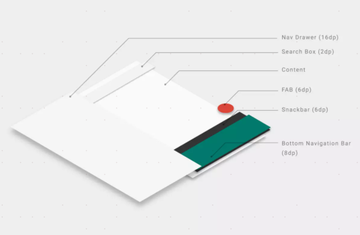

# View

**LayoutInflater**

LayoutInflater inflate() 方法用于动态加载布局，将 XML 布局文件实例化为其对应的 View 对象。

```java
//resource(int): 需要加载的 XML 布局资源的 ID
//root(ViewGroup): 设置加载的布局的父级层次结构
//attachToRoot(boolean): 是否将加载的布局附加到父级层次结构

// 方法一
public View inflate(int resource, ViewGroup root)
// 方法二
public View inflate(int resource, ViewGroup root, boolean attachToRoot) 
```

情况一： root 为 null；

如果 root 为 null，attachToRoot 参数将失去意义。

无需将 resource 指定的布局添加到 root 中，同时没有任何 ViewGroup 容器来协助 resource 指定的布局的根元素生成布局参数 LayoutParams。


情况二： root 不为 null，attachToRoot 为 true；

将 resource 指定的布局添加到 root 中，inflate() 方法返回结合后的 View，其根元素是 root。View 将会根据它的父 ViewGroup 容器的 LayoutParams 进行测量和放置。

使用方法一即未设置 attachToRoot 参数时，如果 root 不为 null，attachToRoot 参数默认为true。


情况三： root 不为 null，attachToRoot 为 false；

无需将 resource 指定的布局添加到 root 中，`inflate()` 方法返回 resource 指定的布局 View，根元素是自身的最外层，View 不存在父 ViewGroup，但是可以根据 root 的 LayoutParams 进行测量和放置。


情况三不解之处在于，既然 attachToRoot 为 false，无需将 resource 指定的布局添加到 root 中，那么为什么 root 仍然不为 null？创建的 View 必然包含 layout 属性，但是这些属性需要在 ViewGroup 容器中才能生效，根据 ViewGroup 容器的 LayoutParams 进行测量和放置 View。

情况三的意思是，无需将 View 添加到某个 ViewGroup 容器中，却又能根据这个 ViewGroup 容器的 LayoutParams 进行测量和放置 View。

情况一和情况三依赖手动添加 View。


**LayoutParams**

先来看看LayoutParams的解释:
LayoutParams继承于Android.View.ViewGroup.LayoutParams.

LayoutParams相当于一个Layout的信息包，它封装了Layout的位置、高、宽等信息。假设在屏幕上一块区域是由一个Layout占领的，如果将一个View添加到一个Layout中，最好告诉Layout用户期望的布局方式，也就是将一个认可的layoutParams传递进去。

但LayoutParams类也只是简单的描述了宽高，宽和高都可以设置成三种值： 

1. 一个确定的值； 
2. MATH_PARENT，即填满（和父容器一样大小）； 
3. WRAP_CONTENT，即包裹住组件就好。

如果某View被LinearLayout包含，则该View的setLayoutParams参数类型必须是LinearLayout.LayoutParams。

**视图绘制流程**

onMeasure() 决定 View 的大小

onLayout() 决定 View 在 ViewGroup 中的位置

onDraw() 绘制 View

**onMeasure()**

视图大小的测量过程，是由父视图、布局文件、以及视图本身共同完成的。

父视图提供参考大小（MeasureSpec: specSize, specMode）给子视图

- UNSPECIFIED 子视图按照自身条件设置成任意的大小

- EXACTLY 父视图希望子视图的大小应该由 specSize 来决定

- AT_MOST 子视图最大只能是 specSize 中指定的大小

布局文件中指定视图的大小

- MATCH_PARENT

- WRAP_CONTENT

视图本身最终决定大小

**onLayout()**

根据测量出来的（onMeasure()）宽度和高度确定视图的位置。关键方法：public void layout (int l, int t, int r, int b) 方法接收左、上、右、下的坐标。

**onDraw()**

完成测量（onMeasure()）和布局操作（onLayout()）之后，创建 Canvas 对象绘制视图。

**事件分发机制**

dispatchTouchEvent()

onInterceptTouchEvent()

onTouchEvent()


事件分发顺序：由 Activity 开始先传递给 ViewGroup 再传递给 View。

**Activity 层面**

事件分发始于 Activity.dispatchTouchEvent() 方法，传递事件至 Window 的根视图。

若最终没有视图消费事件则调用 Activity.onTouchEvent(event) 方法。

**ViewGroup 层面**

ViewGroup 中可以通过 ViewGroup.onInterceptTouchEvent() 方法拦截事件传递，返回 true 代表同一事件列不再向下传递给子 View，返回 false 代表事件继续传递，默认返回 false。

事件递归传递至子 View 的 View.dispatchTouchEvent() 方法，如果事件被子 View 消费，则返回 true，ViewGroup 将无法再处理事件。

如果没有子 View 消费事件则判断 ViewGroup 中是否存在已注册的事件监听器（mOnTouchListener），存在则调用它的 ViewGroup.OnTouchListener.onTouch() 方法，如果 onTouch() 方法返回 false 即未消费事件，则进一步去执行 ViewGroup.onTouchEvent(event) 方法。

**View 层面**

View.dispatchTouchEvent() 方法：首先判断 View 中是否存在已注册的事件监听器（mOnTouchListener），存在则调用它的 View.OnTouchListener.onTouch() 方法，如若 onTouch() 方法返回 false 即未消费事件，则进一步去执行 View.onTouchEvent(event) 方法。

View 可以注册事件监听器（Listener）实现 onClick(View v)、onTouch(View v, MotionEvent event) 方法。相比 onClick() 方法，onTouch() 方法能够做的事情更多，判断手指按下、抬起、移动等事件。同时注册两者事件传递顺序，onTouch() 方法将会先于 onClick() 方法执行，并且 onTouch() 方法可能执行多次（MotionEvent 事件：ACTION_DOWN、ACTION_UP、ACTION_MOVE）。如若设置 onTouch() 方法返回值为 true，事件视为被 onTouch() 方法消费，不再继续向下传递给 onClick() 方法。

**布局性能优化**

优化布局层级

每个控件和布局都需要经过初始化、布局、绘制过程才能呈现出来。当使用多层嵌套的 LinearLayout 以致产生较深的视图层级结构，更甚者在 LinearLayout 中使用 layout_weight 参数，导致子 View 需要两次 onMeasure() 过程。如此反复执行初始化、布局、绘制过程容易造成性能问题。

需要开发者检查布局、修正布局，可以借助 Lint 工具发现布局文件中的视图层级结构里值得优化的地方，同时扁平化处理原本多层嵌套的布局，例如使用 RelativeLayout 作为根节点。

使用 <include/> 复用布局

通过使用 <include/> 和 <merge/> 标签，在当前布局中嵌入另一个较大的布局作为组件，从而复用完整的布局的视图层级结构。

<include/> 和 <merge/> 标签的区别：

<include/> 标签旨在重用布局文件

<merge/> 标签旨在减少视图层级

**画笔&字体**

```java
//基本方法
   
reset();

重置画笔 ，即这个操作会把画笔之前设置的属性全改成默认 比如颜色会变成黑色，无抗锯齿，等等；

setColor(int color);

给画笔设置颜色值 ，int color 的值大家熟悉的是#FFFFFFFF这样的值，但在代码里这样的值是不被使用的必须转过来通过什么工具类我没研究过，但是有更方便的方法。就是关于色彩的理论，带#号的颜色表示方法 其实就是32位argb的表示方案，然而 setColor中我们需要传入的值显然是这个个32位的int值，所以 现在里面我们毋庸置疑的把#改成0x其他不变就好啦；实践证明我的方法是正确的；关于色彩理论我这也讲不明白，想深入研究的可以自行百度谷歌；

setARGB(int a,int r.int g,int b);

同样是设置颜色，不过是把argb分开设置，同样的每个参数还可以用十六进制的int值来传入，比如红色  #FFFF0000 就可以传入，setARGB(0xFF,0xFF,0x00,0x00)，同理也可以用十进制的来传入，setARGB(255,255,0,0)

setAlpha(int a);

设置画笔的透明度

setStyle(Paint.Style s);

设置画笔的样式， 样式取值 有三种: Paint.Style.FILL :填充内部

- Paint.Style.FILL_AND_STROKE ：填充内部和描边

- Paint.Style.STROKE ：仅描边

- setStrokeWidth(float w)：设置画笔描边粗细宽度

- setAntAlias(boolean b)：设置是否抗锯齿

其他方法

setStrokeCap(Paint.Cap cap)

设置画笔线帽的样式  取值有三种 Cap.ROUND 圆形线帽，Cap.SQUARE 方形线帽，Cap.BUTT 无线帽

setStrokeJoin(Paint.Join j);

设置线段连接处的连接模式，取值有：Join.MITER（结合处为锐角）、Join.Round(结合处为圆弧)、Join.BEVEL(结合处为直线)

setStrokeMiter(float miter);

设置笔画的倾斜度，90度拿画笔与30拿画笔，画出来的线条样式肯定是不一样的吧。（事实证明，根本看不出来什么区别好吗……囧……）

setPathEffect(PathEffect effect);

设置路径样式;取值类型是所有派生自PathEffect的子类：ComposePathEffect, CornerPathEffect, DashPathEffect, DiscretePathEffect, PathDashPathEffect, SumPathEffect这四个函数中，setStrokeMiter(float miter)就不再讲了，我做过试验，没什么变化，也就是没啥屌用……，

//字体相关

setTextSize(float textSize);

//设置文字大小

setFakeBoldText(boolean fakeBoldText);

//设置是否为粗体文字

setStrikeThruText(boolean strikeThruText);

//设置带有删除线效果

setUnderlineText(boolean underlineText);

//设置下划线

setTextAlign(Paint.Align align);

//设置开始绘图点位置

setTextScaleX(float scaleX);

//水平拉伸设置

setTextSkewX(float skewX);

//设置字体水平倾斜度，普通斜体字是-0.25，可见往右斜

setTypeface(Typeface typeface);

//字体样式
```


**状态的存储与恢复**

 

需要视图设置id

**自定义属性**

①在资源文件中配置标签属性

在资源文件res/values/attrs.xml中增加 declare-styleable 节点，name为自定义控件名字；如下

```xml
<resources>
    <declare-styleable name="CustomerView">
        //项目中资源id
	    <attr name="background" format="reference" />
        <attr name="src" format="reference" />
        //颜色
        <attr name = "textColor" format = "color" /> 
        //布尔值
        <attr name = "focusable" format = "boolean" /> 
        //尺寸值 dp，sp，px等
        <attr name = "width" format = "dimension" />
        //字符串 
        <attr name = "textStr" format = "string" /> 
        //枚举值
        <attr name="orientation"> 
            <enum name="horizontal" value="0" /> 
            <enum name="vertical" value="1" /> 
        </attr> 
    </declare-styleable>
</resources>
```

其中子节点attr中的name值backound、src、textColor、focusable、width、textStr均为范例，自己写的时候自定义属性名称

②xml布局文件的控件中引用自己定义的属性

引入app的命名空间，自定义属性以"app:"为前缀

```xml
<layout xmlns:app="http://schemas.android.com/apk/res-auto">
	<com.example.weiget.CustomerView
		app:textStr="@string/app_name"
		app:background="@string/app_name"
		android:src="@drawable/compile"
		android:layout_width="match_parent"
		android:layout_height="match_parent"/>
</layout>
```

③项目中自定义属性和布局文件中的属性值都配置好了，如何在自定义控件文件中拿到配置的参数呢；如

```java
public class CustomerView extends AppCompatImageView {
    public CustomerView(Context context) {
        super(context);
        init(context,null);
    }
 
 
    public CustomerView(Context context, AttributeSet attrs) {
        super(context, attrs);
        init(context,attrs);
    }
 
    public CustomerView(Context context, AttributeSet attrs, int defStyleAttr) {
        super(context, attrs, defStyleAttr);
        init(context,attrs);
    }
 
    private void init(Context context, AttributeSet attrs) {
        if(attrs != null) {
            //从项目style中文件中取出样式数组
            TypedArray typedArray = context.obtainStyledAttributes(attrs, R.styleable.CustomerView);
            //取到xml布局文件中配置的资源文件
            Drawable drawable = typedArray.getDrawable(R.styleable.CustomerView_src);
            //字符串
            String string = typedArray.getString(R.styleable.CustomerView_textStr);
            //布尔值
            boolean aBoolean = typedArray.getBoolean(R.styleable.CustomerView_focusable, false);
        }
    }
}
从typeArray数组中取值的参数，其中参数命门规则为R.styleable.控件名_属性名
```

  只会获取用户设定的值，不会造成成员变量的覆盖

## ProgressBar

**属性**

```xml
progress="" //设置进度

max="" //设置最大值，默认100

indeterminate="true" //设置进度条一直滚动
```

## ImageView

**属性**

```xml
scaleType
//fitXY∶撑满控件，宽高比可能发生改变
//fitCenter:保持宽高比缩放，直至能够完全显示
//centerCrop∶保持宽高比缩放，直至完全覆盖控件，裁剪显示

android:rotation 
//旋转角度，可以设置正值负值，代表顺时针或逆时针
//还有rotationX、rotationY

android:adjustViewBounds="true"
//解决旋转后边距问题
//https://blog.csdn.net/u011622280/article/details/110111667

contentDescription
//一个ImageView里面放置一张颜色复杂的图片，可能一些色弱色盲的人，分不清这张图片中画的是什么东西。如果用户安装了辅助浏览工具比如TalkBack,
TalkBack就会大声朗读出用户目前正在浏览的内容。TextView控件TalkBack可以直接读出里面的内容，但是ImageView TalkBack就只能去读contentDescription的值，告诉用户这个图片到底是什么。
//https://blog.csdn.net/TrineaShao/article/details/72459538
```

### ImageButton

#### FloatingActionButton

**支持库**

android.support.design.widget.FloatingActionButton

```bash
    compile 'com.android.support:design:25.3.1'
```

**继承**

Object > View > ImageView > ImageButton > FloatingActionButton

**属性**

````java
//设置不同的图片
android:src=""
mFAButton.setImageResource(R.drawable.ic_action); //设置Fab的背景内容

//设置背景颜色
app:backgroundTint=""，FloatingActionButton的颜色是跟随主题中的 colorAccent属性的

注意要使用自定义命名空间xmlns:app="http://schemas.android.com/apk/res-auto"，因为FloatingActionButton重写了继承自View的android:backgroundTint属性，使用android:backgroundTint改变背景颜色会导致Fab四周有一个用colorAccent颜色填充的圆环。
产生涟漪效果，记得设置属性android:clickable="true"。
默认的背景颜色是所使用主题的colorAccent颜色。

mFAButton.setBackgroundTintList(ColorStateList.valueOf(Color.parseColor("#FF13C6DA"))); //设置Fab的背景颜色

app:borderWidth="0dp"

在5.0之前，FloatingActionButton距离底部会有一个间隔，在5.0之后就没有了，解决方法就是设置以上属性

app:fabSize

为了符合Material Design的设计风格，Google给出了FloatingActionButton的三种大小值：mini、normal、auto。

auto：FloatingActionButton的大小会根据屏幕的大小自己改变，对于小屏幕设备（最大屏幕尺寸小于470 dp）会使用mini尺寸，比这个更大的屏幕会使用normal尺寸。

mFAButton.setSize(FloatingActionButton.SIZE_AUTO); // 设置Fab的大小

app:elevation="6dp"

为了有投影悬浮效果，为FloatingActionButton设置一个高度值。
高度值越大，投影效果越淡，投影范围越大。
高度值越小，投影效果越浓，投影范围越小。

//设置FloatingActionButton的高度值，产生相应的阴影效果
mFAButton.setCompatElevation(5.0F); 

app:rippleColor

为了符合Material Design的设计风格，为了使可点击的选项给用户反馈，点击时会有水波纹扩散的效果。

默认值是灰色的水波纹效果。
如果设置rippleColor没有效果，记得设置属性android:clickable="true"。

mFAButton.setRippleColor(Color.parseColor("#FFFFFFFF")); //设置涟漪效果颜色
    
app:pressedTranslationZ="10dp"

设置阴影的点击效果。与elevation控制的同一地方的阴影，不过elevation是非按压时的阴影效果，而pressedTranslationZ是点击按钮时阴影的效果（按钮被按压了，阴影当然也要随着变化啦）。

值越大，按下时阴影范围越大。这个值一般默认就好。

app:useCompatPadding="true"

这个属性会让FloatingActionButton自己调整内边距。不过在5.0系统上设置此属性会导致按压时产生方形阴影效果，影响美观度。一般用android:layout_margin属性调整即可。

````

## TextView

TextView类似于Swing中的JLabel ,能完成的效果:

- 对长文本进行显示处理
- 支持Html代码
- 内容有样式、链接效果

```
android:includeFontPadding = "false"
Google为了显示上下标而给TextView预设的padding，将这个属性设置为false即可去除padding（默认为true），实现文本的上对齐与下对齐

/**自动调整字体大小**/
android:autoSizeTextType：
自动调整大小的类型，取值none（0，不自动缩放，默认）或者uniform（1，水平和垂直均匀缩放文本大小适应容器），注意：这个功能不适用与EditText，仅仅TextView有效
android:autoSizeMaxTextSize：
自动调整文本大小的最大值，可用的单位有：px（pixels），dp（density-independent pixels），sp（scaled pixels based on preferred font size），in（inches），还有mm（millimeters）
android:autoSizeMinTextSize：
自动调整文本大小的最小值，可用的单位有：px（pixels），dp（density-independent pixels），sp（scaled pixels based on preferred font size），in（inches），还有mm（millimeters）
android:autoSizePresetSizes：
预设定的尺寸数组（类型为uniform时生效），会autoSizeStepGranularity属性覆盖
android:autoSizeStepGranularity：
自动调整字体大小的阶级（类型为uniform时生效），默认1px，会被autoSizePresetSizes属性覆盖

//关于字体大小使用sp?dp?
如果使用dp则设置系统字体大小的时候app内的字体大小不变，使用sp则改变，一般实际开发中使用dp，防止布局错位，然后在app内提供设置字体大小的功能
```

### Button

**属性**

```xml
textAllCaps//是否全为大写
```

#### CompoundButton

##### RadioButton

**属性**

```
android:orientation="vertical"
//设置内部空间的排列方向，水平或竖直

android:buttonTint="@color/..."
//设置选中按钮的颜色
```

##### CheckBox

### EditText

**输入类型**

```xml
android:inputType=”none”
android:inputType=”text”
android:inputType=”textCapCharacters” 字母大写
android:inputType=”textCapWords” 首字母大写
android:inputType=”textCapSentences” 仅第一个字母大写
android:inputType=”textAutoCorrect” 自动完成
android:inputType=”textAutoComplete” 自动完成
android:inputType=”textMultiLine” 多行输入
android:inputType=”textImeMultiLine” 输入法多行（如果支持）
android:inputType=”textNoSuggestions” 不提示
android:inputType=”textUri” 网址
android:inputType=”textEmailAddress” 电子邮件地址
android:inputType=”textEmailSubject” 邮件主题
android:inputType=”textShortMessage” 短讯
android:inputType=”textLongMessage” 长信息
android:inputType=”textPersonName” 人名
android:inputType=”textPostalAddress” 地址
android:inputType=”textPassword” 密码
android:inputType=”textVisiblePassword” 可见密码
android:inputType=”textWebEditText” 作为网页表单的文本
android:inputType=”textFilter” 文本筛选过滤
android:inputType=”textPhonetic” 拼音输入
//数值类型
android:inputType=”number” 正整数
android:inputType=”numberSigned” 带符号数字格式
android:inputType=”numberDecimal” 带小数点的浮点格式
android:inputType=”phone” 拨号键盘
android:inputType=”datetime” 时间日期
android:inputType=”date” 日期键盘
android:inputType=”time” 时间键盘
```

**大小设置**

①layout_width和layout_height

layout_width告诉父容器EditText需要的宽度，layout_height则设置需要的高度。单位建议为dp，关于Android中单位转换问题可以参考Android根据分辨率进行单位转换-(dp,sp转像素px)。

②minWidth/maxHeight和minHeight/maxHeight

这些属性用来动态的限制EditText的大小，应用场景有如下几种情况：

1)在没有内容情况下，通过min系列保证控件的最小宽高，保持界面整体美观。

2)在内容过多情况下，使用max系列来限制控件大小，确保不影响界面上的其他控件。

PS：还可以使用minLines和maxLines来限制内容显示的行数。

③ems、minEms和maxEms

ems指的是字体的宽度。此属性在Android中用来设置EditText的宽度，即设置EditText为n个字符的宽度。

PS：android:layout_width必须为wrap_content,否则ems将无效。

```xml
<EditText 
       android:id="@+id/etTest" 
       android:layout_width="wrap_content"
       android:layout_height="wrap_content" android:ems="4"/>
```

④Android取消EditText自动获取焦点默认行为

在项目中，一进入一个页面, EditText默认就会自动获取焦点,很是郁闷，Android 如何让EditText不自动获取焦点？

在EditText的父级控件中找一个，设置成 

```
android:focusable="true" 
android:focusableInTouchMode="true" 
```

这样，就把EditText默认的行为截断了！ 

**自定义样式**

1. 光标

step1 在drawable目录下自定义光标文件(一般为shape文件)，比如以下文件为:text_cursor.xml

step2 在xml 中给edittext设置属性

android:textCursorDrawable="@drawable/text_cursor"

step3 设置光标位置

android:gravity="left" //光标位于最开始位置

android:gravity="center" //光标位于中间位置

**监听器**

view.addTextChangedListener(new TextWatcher())

监听用户输入完成

常见问题

- 不显示输入文本和光标

原因：文本光标太大从edittext中跑出去了

解决：将edittext的高度设置为wrap_content

**注意**

点击屏幕其他地方让EditText失去焦点并隐藏输入法

https://blog.csdn.net/rongwenbin/article/details/51151244

## SurfaceView

**SurfaceView与View区别**

1.不使用onDraw

2.非UI线程绘制

3.独立的Surface

**使用SurfaceView**

1.利用SurfaceHolder监听Surface创建完毕

2.开启异步线程进行while循环

3.通过SurfaceHolder获取Canvas进行绘制

**SurfaceView的具体使用场景**

1.视频播放

2.一些炫酷的动画效果

3.小游戏

## ViewGroup

**常用方法**

addView();

```java
addView(View child);// child-被添加的View
addView(View child, int index);// index-被添加的View的索引,最初的index为0
addView(View child, int width, int height);// width,height被添加的View指定的宽高
addView(View view, ViewGroup.LayoutParams params);// params被添加的View指定的布局参数
addView(View child, int index, LayoutParams params);
```

①在LinearLayout中的使用

在线性布局中，我们调用addView(View child)方法时，会在指定的方向的最后一个View的下面添加上child这个View，也就是说被添加的View的索引总是等于容器中当前子View的个数
当我们为添加的View指定了index后，我们被添加的View就会被添加到容器中指定的索引位置处，并把之前的View(包括此View后面的View)全部向后“挤”了一位
index我们可不可以随意定义呢？答案当然是不可以了。凡事都要讲究一个顺序嘛，总不能原来容器中只有2个子View，最大的索引才是1，你就一下子想把添加的View指定到索引10吧。因此，在我们向指定索引的时候，我们应当先做一个判断，确保我们指定的index不能大于当前容器内View的总数量

②在RelativeLayout中的使用

### GridLayout

**属性**

```xml
android:rowCount//行数量
android:columnCount//列数量
android:layout_row//位于第几行
android:layout_rowSpan//跨几行
```

**例子**


### MapView

### AdapterView

#### AbsListView

##### GridView

##### ListView

**适配器**

ArrayAdapter

SimpleAdapter

```java
        //左边:头像右上:名字右下:心情
        Map<String, Object> map1 = new HashMap<>();
        map1.put("img", R.mipmap.caocad);
        map1.put("name", "曹操");
        map1.put("mood", "宁教我负天下人,休教天下人负我");
        Map<String, Object> map2 = new HashMap<>();
        map2.put("img", R.mipmap.zhenji);
        map2.put("name", "甄姬");
        map2.put("mood", "飘摇兮若流风之回雪。仿佛兮若轻云之蔽月");
        Map<String, Object> map3 = new HashMap<>();
        map3.put("img", R.mipmap.zhenji);
        map3.put("name", "甄姬");
        map3.put("mood", "飘摇兮若流风之回雪,仿佛兮若轻云之蔽月");

        String[] from = {"img", "name", "mood"};
        int[] to = {R.id.qq_img, R.id.qq_name, R.id.qq_mood};
        //参数1:上下文
        //参数2:Map
        //参数3:每一项布局
        //参数4:数据来源的key数组
        //参数5:数据去向的id数组
        //参数45对应索引上，from数组的元素代码数据源每个map的key，
		//该key所指代的数据会作为to数组对应索引上id所代表的控件的内容显示处理
        SimpleAdapter adapter = new SimpleAdapter(this, data, R.layout.item3, from, to);

        //点击事件
        listView2.setOnItemClickListener(new AdapterView.OnItemClickListener() {
            @Override
            public void onItemClick(AdapterView<?> adapterView, View view, int i, long l) 				{
                //用Toast提示Name· Mood
                Map<String, Object> map = data.get(i);
                String name = map.get("name").toString();
                String mood = map.get("mood").toString();
                Toast.makeText(SimpleActivity.this, 
                               name + ". " + mood,
                               Toast.LENGTH_SHORT), show();
            });
        }
```

**属性**

```xml
Android:divider=”@null”;//去除分割线
```

**方法**

```java
//设置listview自动显示到最新数据
listview,setTranscriptMode(AbsListView.TRANSCRIPT_MODE_ALWAYS_SCORLL)
```

**优化**

在getView方法中

```java
if(view==null){
    Log.e("TAG","========="+i);
    //优化1:利用进入RecyclerBin中的View,减少读view的赋值
    view = LayoutInflater.from(ctx).inflate(R.layout.item,null);
}
```

定义内部类ViewHolder,将需要保存的视图声明为公开的属性

- 保存：当view为空时，完成对viewHolder的实例化工作，并为各个控件属性赋值
- 使用的时机：什么时候都要用，性能的提升在view不为空时体现
- 使用的方法：当view为null时，完成了ViewHolder及内部控件属性的初始化工作后，调用一句代码view.setTag(holder);当view不为null时，holder=(ViewHolder)view.getTag();

```java
ViewHolder holder;
if(view==null){
    Log.e("TAG","====="+i); 
    //优化1:利用进入RecyclerBin中的View,减少读view的赋值
    view = LayoutInflater.from(ctx).inflate(R.layout.item,null);
    holder = new ViewHolder();
    holder.profile = view.findViewById(R.id.profile);
    holder.nickname=view.findViewById(R.id.nickname);
    holder.content = view.findViewById(R.id.content);
    ...
    view.setTag(holder);
}else{
    //通过getTag()取出ViewHolder对象，然后能够直接通过holder.控件的方式在外面直接操作控件
    //从而避免了大幅度使用findViewById操作
    //而事实上，getTag()本身操作效率高
    holder = (ViewHolder)view.getTag();
}
```

ListView的优化(以异步加载Bitmap优化为例)
首先概括的说ListView优化分为三级缓存:

内存缓存
文件缓存
网络读取
简要概括就是在getView中，如果加载过一个图片，放入Map类型的一个MemoryCache中(示例代码使用的是Collections.synchronizedMap(new LinkedHashMap(10, 1.5f, true))来维护一个试用LRU的堆)。如果这里获取不到，根据View被Recycle之前放入的TAG中记录的uri从文件系统中读取文件缓存。如果本地都找不到，再去网络中异步加载。

这里有几个注意的优化点：

从文件系统中加载图片也没有内存中加载那么快，甚至可能内存中加载也不够快。因此在ListView中应设立busy标志位，当ListView滚动时busy设为true，停止各个view的图片加载。否则可能会让UI不够流畅用户体验度降低。
文件加载图片放在子线程实现，否则快速滑动屏幕会卡
开启网络访问等耗时操作需要开启新线程，应使用线程池避免资源浪费，最起码也要用AsyncTask。
Bitmap从网络下载下来最好先放到文件系统中缓存。这样一是方便下一次加载根据本地uri直接找到，二是如果Bitmap过大，从本地缓存可以方便的使用Option.inSampleSize配合Bitmap.decodeFile(ui, options)或Bitmap.createScaledBitmap来进行内存压缩
**原博文有非常好的代码示例: Listview异步加载图片之优化篇（有图有码有解释）非常值得看看。

此外Github上也有仓库：https://github.com/geniusgithub/SyncLoaderBitmapDemo

##### ExpandableListView

### ExpanableListView


**常用属性**

```xml
groupIndicator="@drawable/xxxxxxxxx"
展开和收缩的时候分别展示不同的图标

childIndicator="@drawable/xxxxxx"
每个子列表展示的图标

childDivider=“@color/xxxxxxxxx"
每个子列表的分割线
```

**常用方法**

```java
setAdapter(ExpandableListAdapter);

setOnGroupClickListener();

setOnChildClickListener();
    
setOnGroupCollapseListener();

setOnGroupExpandListener();
    
```

### 

### RelativeLayout

### LinearLayout

#### RadioGroup

#### TableLayout

**属性**

```xml
android:stretchColumns="1,2”//设置可伸展的列
android:shrinkColumns="1,2”//设置可收缩的列
android:collapseColumns="0,1”//设置可隐藏的列
```

**注意**

如果直接在TableLayout中添加控件﹐那么控件将和父容器等宽如果想让控件出现在同一行﹐那么这些控件的外层一定要加一对在TableRow中的控件﹐宽度都是默认wrap_content

### FrameLayout

**重要属性**

```xml
android:layout_gravity//控件重力
android:foreground//前景
android:foregroundGravity//前景重力
```

#### ScrollView

ScrollView的子元素只能有一个，可以是一个View（如ImageView、TextView等） 也可以是一个ViewGroup（如LinearLayout、RelativeLayout等），其子元素内部则不再限制，否则会报异常。

**继承**

Object > View > ViewGroup > FrameLayout > ScrollView & HorizontalScrollView

**常用属性**

```xml
android:fadingEdge="none"
设置拉滚动条时，边框渐变的方向。none（边框颜色不变），horizontal（水平方向颜色变淡），vertical（垂直方向颜色变淡）。

android:overScrollMode="never"
删除ScrollView拉到尽头（顶部、底部），然后继续拉出现的阴影效果，适用于2.3及以上的 否则不用设置。

android:scrollbars="none"
设置滚动条显示，none（隐藏），horizontal（水平），vertical（垂直）。

android:descendantFocusability=""
该属性是当一个为view获取焦点时，定义ViewGroup和其子控件两者之间的关系。
属性的值有三种：
beforeDescendants    //viewgroup会优先其子类控件而获取到焦点
afterDescendants    //viewgroup只有当其子类控件不需要获取焦点时才获取焦点
blocksDescendants    //viewgroup会覆盖子类控件而直接获得焦点

android:fillViewport=“true"
这是 ScrollView 独有的属性，用来定义 ScrollView 对象是否需要拉伸自身内容来填充
viewport。通俗来说，就是允许ScrollView去填充整个屏幕。比如ScrollView嵌套的子控件高度达不到屏幕高度时，虽然ScrollView高度设置了match_parent，也无法充满整个屏幕，需设置android:fillViewport=“true"使ScrollView填充整个页面，给ScrollView设置背景颜色就能体现。
```

**常用方法**

```java
//滑动开关控制
scrollView.setOnTouchListener(new View.OnTouchListener() {
    @Override
     public boolean onTouch(View view, MotionEvent motionEvent) {
        // true禁止滑动  false可滑动
         return true;
      }
});

//滑动位置控制
scrollView.post(new Runnable() {
    @Override
    public void run() {
        //滑动到顶部
        scrollView.fullScroll(ScrollView.FOCUS_UP);
        
        //滑动到底部
        scrollView.fullScroll(ScrollView.FOCUS_DOWN);
    }
});

//滑动到某个位置
scrollView.post(new Runnable() {
    @Override
    public void run() {
        //偏移值
        int offset = 100;
        scrollView.smoothScrollTo(0, offset);
    }
});
```

#### CardView

**Z轴的概念**



Z属性可以通过elevation和translationZ进行修改
Z＝ elevation＋translationZ

android:elevation=" "  设置该属性使控件有一个阴影，感觉该控件像是“浮”起来一样，达到3D效果

android:translationZ=""  设置该组件阴影在Z轴（垂直屏幕方向）上的位移

在5.0之前，我们如果想给View添加阴影效果，以体现其层次感，通常的做法是给View设置一个带阴影的背景图片.
在5.0之后，我们只需要简单的修改View的Z属性，就能让其具备阴影的层次感，不过要求版本至少5.0 Lollipop,也就是API21.

在Android Design Support Library和support -v7中一些组件已经封装好了Z属性，不需要5.0 就可以使用.

像FloatingActionButton就可以通过app:elevation=" "使用Z属性，CardView可以通过app:cardElevation=" " 来使用.

**属性**

```xml
app:cardCornerRadius=""//卡片边角半径
app:cardBackgroundColor=" "//设置背景颜色,直接设置android:background=" "无效
app:contentPadding=" "//设置padding,直接设置android:padding=" "无效
app:contentPaddingTop=" "
app:contentPaddingBottom=" "
app:contentPaddingLeft=" "
app:contentPaddingRight=" "
app:cardElevation=""//卡片的阴影实际宽度，大家都知道 Material Design 就是引入了材质厚度的概念。实际就是通过投射阴影的原理实现这种视觉效果。
app:cardMaxElevation=" "//设置Z轴的最大高度
app:cardPreventCornerOverlap=""//设置是否圆角重叠。
android:foreground="?android:attr/selectableItemBackground"//设置点击了之后的涟漪效果
```

如果你的CardView是可点击的，可以通过foreground属性使用系统定义好的RippleDrawable: selectableItemBackground，从而达到在5.0及以上版本系统中实现点击时的涟漪效果（Ripple）。涟漪效果在5.0以上版本中才能展示，在低版本上是一个普通的点击变暗的效果

**兼容问题**

https://www.jianshu.com/p/b105019028b6

### AbsoluteLayout

#### WebView

基于webkit内核（Chromium)

### ConstraintLayout

**添加依赖**

```
implementation 'com.android.support.constraint:constraint-layout:1.1.3'
```

**常用属性**

*layout_constraintLeft_toLeftOf*

此控件的左边与另一个控件的左边对齐

*layout_constraintLeft_toRightOf*

此控件的左边与另一个控件的右边对齐

*layout_constraintRight_toLeftOf*

此控件的右边与另一个控件的左边对齐

*layout_constraintRight_toRightOf*

此控件的右边与另一个控件的右边对齐

*layout_constraintTop_toTopOf* 

此控件的顶部与另一个控件的顶部对齐

*layout_constraintTop_toBottomOf* 

此控件的顶部与另一个控件的底部对齐

*layout_constraintBottom_toTopOf* 

此控件的底部与另一个控件的顶部对齐

*layout_constraintBottom_toBottomOf* 

此控件的底部与另一个控件的底部对齐

*layout_constraintBaseline_toBaselineOf* 

文本对齐


```xml
    <TextView
        android:id="@+id/TextView1"
        .../>
  
    <TextView
        android:id="@+id/TextView2"
        ...
        app:layout_constraintLeft_toRightOf="@+id/TextView1" 
        app:layout_constraintBaseline_toBaselineOf="@+id/TextView1"/>
```


*layout_constraintStart_toEndOf*

此控件的开始与另一控件的结束对齐

*layout_constraintStart_toStartOf*

此控件的开始与另一控件的开始对齐

*layout_constraintEnd_toStartOf*

此控件的结束与另一控件的开始对齐

*layout_constraintEnd_toEndOf* 

此控件的结束与另一控件的结束对齐

**角度定位**

```xml
    <TextView
        android:id="@+id/TextView1"
        android:layout_width="wrap_content"
        android:layout_height="wrap_content" />

    <TextView
        android:id="@+id/TextView2"
        android:layout_width="wrap_content"
        android:layout_height="wrap_content"
        app:layout_constraintCircle="@+id/TextView1"
        app:layout_constraintCircleAngle="120"
        app:layout_constraintCircleRadius="150dp" />
```

上面例子中的TextView2用到了3个属性:
app:layout_constraintCircle="@+id/TextView1"
app:layout_constraintCircleAngle="120"(角度)
app:layout_constraintCircleRadius="150dp"(距离)
指的是TextView2的中心在TextView1的中心的120度,距离为150dp,效果如下:


**margin**

在约束布局中使用margin,控件必须在布局里约束一个相对位置
margin只能大于等于0

**goneMargin**

```xml
<android.support.constraint.ConstraintLayout 
    android:layout_width="match_parent"
    android:layout_height="match_parent">

    <TextView
        android:id="@+id/TextView1"
        .../>

    <TextView
        android:id="@+id/TextView2"
        ...
        app:layout_constraintLeft_toRightOf="@+id/TextView1"
        app:layout_goneMarginLeft="10dp"
        />

</android.support.constraint.ConstraintLayout>
```

效果如下,TextView2在TextView1的右边,且没有边距。


这个时候把TextView1的可见性设为gone,效果如下:


TextView1消失后,TextView2有一个距离左边10dp的边距。

**居中和偏移**

①居中:

```xml
    app:layout_constraintBottom_toBottomOf="parent"
    app:layout_constraintLeft_toLeftOf="parent"
    app:layout_constraintRight_toRightOf="parent"
    app:layout_constraintTop_toTopOf="parent"
```

②水平居中:

```xml
       app:layout_constraintLeft_toLeftOf="parent"
       app:layout_constraintRight_toRightOf="parent"
```

③垂直居中:

```xml
       app:layout_constraintTop_toTopOf="parent"
       app:layout_constraintBottom_toBottomOf="parent"
```

**偏移**

```xml
    <TextView
       android:id="@+id/TextView1"
       ...
       android:layout_marginLeft="100dp"
       app:layout_constraintLeft_toLeftOf="parent"
       app:layout_constraintRight_toRightOf="parent" />
```


```xml
    <TextView
       android:id="@+id/TextView1"
       ...
       app:layout_constraintHorizontal_bias="0.3"
       app:layout_constraintLeft_toLeftOf="parent"
       app:layout_constraintRight_toRightOf="parent" />
```


假如现在要实现水平偏移,给TextView1的layout_constraintHorizontal_bias赋一个范围为 0-1 的值,假如赋值为0,则TextView1在布局的最左侧,假如赋值为1,则TextView1在布局的最右侧,假如假如赋值为0.5,则水平居中,假如假如赋值为0.3,则更倾向于左侧。
垂直偏移同理。

**尺寸约束**

控件的尺寸可以通过四种不同方式指定:

①使用指定的尺寸

②使用wrap_content,让控件自己计算大小

当控件的高度或宽度为wrap_content时,可以使用下列属性来控制最大、最小的高度或宽度:

- android:minWidth 最小的宽度
- android:minHeight 最小的高度
- android:maxWidth 最大的宽度
- android:maxHeight 最大的高度

注意!当ConstraintLayout为1.1版本以下时,使用这些属性需要加上强制约束,如下所示:
app:constrainedWidth="true"
app:constrainedHeight="true"

③使用 0dp (MATCH_CONSTRAINT)

```xml
  <TextView
        android:id="@+id/TextView1"
        android:layout_width="0dp"
        android:layout_height="wrap_content"
        android:layout_marginLeft="50dp"
        app:layout_constraintLeft_toLeftOf="parent"
        app:layout_constraintRight_toRightOf="parent"
        android:visibility="visible" />
```


④宽高比

```xml
  <TextView
        android:id="@+id/TextView1"
        android:layout_width="0dp"
        android:layout_height="wrap_content"
        app:layout_constraintDimensionRatio="1:1"
        app:layout_constraintLeft_toLeftOf="parent"
        app:layout_constraintRight_toRightOf="parent" />
```


在设置宽高比的值的时候,还可以在前面加W或H,分别指定宽度或高度限制。 例如:
app:layout_constraintDimensionRatio="H,2:3"指的是 高:宽=2:3
app:layout_constraintDimensionRatio="W,2:3"指的是 宽:高=2:3

**链**

如果两个或以上控件通过下图的方式约束在一起,就可以认为是他们是一条链(图为横向的链,纵向同理)。


```xml
  <TextView
      android:id="@+id/TextView1"
      android:layout_width="wrap_content"
      android:layout_height="wrap_content"
      app:layout_constraintLeft_toLeftOf="parent"
      app:layout_constraintRight_toLeftOf="@+id/TextView2" />

  <TextView
      android:id="@+id/TextView2"
      android:layout_width="wrap_content"
      android:layout_height="wrap_content"
      app:layout_constraintLeft_toRightOf="@+id/TextView1"
      app:layout_constraintRight_toLeftOf="@+id/TextView3"
      app:layout_constraintRight_toRightOf="parent" />

  <TextView
      android:id="@+id/TextView3"
      android:layout_width="wrap_content"
      android:layout_height="wrap_content"
      app:layout_constraintLeft_toRightOf="@+id/TextView2"
      app:layout_constraintRight_toRightOf="parent" />
```

3个TextView相互约束,两端两个TextView分别与parent约束,成为一条链,效果如下:


一条链的第一个控件是这条链的链头,我们可以在链头中设置 layout_constraintHorizontal_chainStyle来改变整条链的样式。chains提供了3种样式,分别是:

- CHAIN_SPREAD —— 展开元素 (默认)；
- CHAIN_SPREAD_INSIDE —— 展开元素,但链的两端贴近parent；
- CHAIN_PACKED —— 链的元素将被打包在一起。

如图所示:


上面的例子创建了一个样式链,除了样式链外,还可以创建一个权重链。
可以留意到上面所用到的3个TextView宽度都为wrap_content,如果我们把宽度都设为0dp,这个时候可以在每个TextView中设置横向权重layout_constraintHorizontal_weight(constraintVertical为纵向)来创建一个权重链,如下所示:

```xml
     <TextView
        android:id="@+id/TextView1"
        android:layout_width="0dp"
        android:layout_height="wrap_content"
        app:layout_constraintLeft_toLeftOf="parent"
        app:layout_constraintRight_toLeftOf="@+id/TextView2"
        app:layout_constraintHorizontal_weight="2" />

    <TextView
        android:id="@+id/TextView2"
        android:layout_width="0dp"
        android:layout_height="wrap_content"
        app:layout_constraintLeft_toRightOf="@+id/TextView1"
        app:layout_constraintRight_toLeftOf="@+id/TextView3"
        app:layout_constraintRight_toRightOf="parent"
        app:layout_constraintHorizontal_weight="3" />

    <TextView
        android:id="@+id/TextView3"
        android:layout_width="0dp"
        android:layout_height="wrap_content"
        app:layout_constraintLeft_toRightOf="@+id/TextView2"
        app:layout_constraintRight_toRightOf="parent"
        app:layout_constraintHorizontal_weight="4" />
```

效果如下:


**辅助工具**

①Optimizer

当我们使用 MATCH_CONSTRAINT 时,ConstraintLayout 将对控件进行 2 次测量,ConstraintLayout在1.1中可以通过设置 layout_optimizationLevel 进行优化,可设置的值有:

- none:无优化
- standard:仅优化直接约束和屏障约束(默认)
- direct:优化直接约束
- barrier:优化屏障约束
- chain:优化链约束
- dimensions:优化尺寸测量

②Barrier


假设有3个控件ABC,C在AB的右边,但是AB的宽是不固定的,这个时候C无论约束在A的右边或者B的右边都不对。当出现这种情况可以用Barrier来解决。Barrier可以在多个控件的一侧建立一个屏障,如下所示:


这个时候C只要约束在Barrier的右边就可以了,代码如下:

```xml
    <TextView
       android:id="@+id/TextView1"
       android:layout_width="wrap_content"
       android:layout_height="wrap_content" />

    <TextView
       android:id="@+id/TextView2"
       android:layout_width="wrap_content"
       android:layout_height="wrap_content"
       app:layout_constraintTop_toBottomOf="@+id/TextView1" />

    <android.support.constraint.Barrier
       android:id="@+id/barrier"
       android:layout_width="wrap_content"
       android:layout_height="wrap_content"
       app:barrierDirection="right"
       app:constraint_referenced_ids="TextView1,TextView2" />

    <TextView
       android:id="@+id/TextView3"
       android:layout_width="wrap_content"
       android:layout_height="wrap_content"
       app:layout_constraintLeft_toRightOf="@+id/barrier" />
```

app:barrierDirection为屏障所在的位置,可设置的值有:bottom、end、left、right、start、top
app:constraint_referenced_ids为屏障引用的控件,可设置多个(用","隔开)

**Group**

Group可以把多个控件归为一组,方便隐藏或显示一组控件,举个例子:

```xml
    <TextView
       android:id="@+id/TextView1"
       android:layout_width="wrap_content"
       android:layout_height="wrap_content" />

    <TextView
       android:id="@+id/TextView2"
       android:layout_width="wrap_content"
       android:layout_height="wrap_content"
       app:layout_constraintLeft_toRightOf="@+id/TextView1" />

    <TextView
       android:id="@+id/TextView3"
       android:layout_width="wrap_content"
       android:layout_height="wrap_content"
       app:layout_constraintLeft_toRightOf="@id/TextView2" />
```


现在有3个并排的TextView,用Group把TextView1和TextView3归为一组,再设置这组控件的可见性,如下所示:

```xml
    <android.support.constraint.Group
       android:id="@+id/group"
       android:layout_width="wrap_content"
       android:layout_height="wrap_content"
       android:visibility="invisible"
       app:constraint_referenced_ids="TextView1,TextView3" />
```


**Placeholder**

Placeholder指的是占位符。在Placeholder中可使用setContent()设置另一个控件的id,使这个控件移动到占位符的位置。举个例子:

```xml
<android.support.constraint.Placeholder
   android:id="@+id/placeholder"
   android:layout_width="wrap_content"
   android:layout_height="wrap_content"
   app:content="@+id/textview"
   app:layout_constraintLeft_toLeftOf="parent"
   app:layout_constraintTop_toTopOf="parent" />

<TextView
   android:id="@+id/textview"
   android:layout_width="wrap_content"
   android:layout_height="wrap_content"
   android:background="#cccccc"
   android:padding="16dp"
   android:text="TextView"
   android:textColor="#000000"
   app:layout_constraintRight_toRightOf="parent"
   app:layout_constraintTop_toTopOf="parent" />
```

新建一个Placeholder约束在屏幕的左上角,新建一个TextView约束在屏幕的右上角,在Placeholder中设置 app:content="@+id/textview",这时TextView会跑到屏幕的左上角。效果如下:


**Guideline**

Guildline像辅助线一样,在预览的时候帮助你完成布局(不会显示在界面上)。

Guildline的主要属性:

- android:orientation 垂直vertical,水平horizontal
- layout_constraintGuide_begin 开始位置
- layout_constraintGuide_end 结束位置
- layout_constraintGuide_percent 距离顶部的百分比(orientation = horizontal时则为距离左边)

举个例子:

```xml
    <android.support.constraint.Guideline
       android:id="@+id/guideline1"
       android:layout_width="wrap_content"
       android:layout_height="wrap_content"
       android:orientation="horizontal"
       app:layout_constraintGuide_begin="50dp" />

    <android.support.constraint.Guideline
       android:id="@+id/guideline2"
       android:layout_width="wrap_content"
       android:layout_height="wrap_content"
       android:orientation="vertical"
       app:layout_constraintGuide_percent="0.5" />
```

guideline1为水平辅助线,开始位置是距离顶部50dp,guideline2位垂直辅助线,开始位置为屏幕宽的0.5(中点位置),效果如下:


### ViewPager

**导入**

<android.support.v4.view.ViewPager/>

**使用**

step1 定义ViewPager对象和视图id数组


step2 把视图添加到视图List中


step3 添加适配器PagerAdapter


或者FragmentPagerAdapter


Fragment中


**监听器**

①视图转换监听器


### RecyclerView

**添加依赖**

```gradle
implementation 'com.android.support:appcompat=v7:28.0.0'
implementation 'com.android.support:recyclerview-V7:28.0.0'//版本需要和appcompat包的版本一致
```

忽略警告的操作：


**布局方式**

```java
LinearLayoutManager linearLayoutManager = new LinearLayoutManager( context: this)
//横向排列ItemView
linearLayoutManager.setOrientation(LinearLayoutManager.HORIZONTAL);
mRecyclerView.setLayoutManager( linearLayoutManager);
//数据反向展示
linearLayoutManager.setReverseLayout(true);
//网格布局
GridLayoutManager gridLayoutManager = new GridLayoutManage(this,2)
mRecyclerView.setLayoutManager(gridLayoutManager);
//瀑布流布局
StaggeredGridLayoutManager staggeredGridLayoutManager = new StaggeredGridLayoutManager(2StaggeredGridLayoutManager.VERTICAL);
StaggeredGridLaymRecyclerView.setLayoutManager(staggeredGridLayoutManager);
```

**recyclerView.requestLayout():**

当我们按下某个按钮的时候，我们选择的布局发生改变，如原先我们使用的是item_defalut布局，之后使用的是item_selected布局，再次按下按钮，布局又从item_selected变回item_default.

官方文档

https://developer.android.com/guide/topics/ui/layout/recyclerview?gclid=CjwKCAiAg6yRBhBNEiwAeVyL0J8fiOjFy0GepIR3niy5Q9c2Olf5aeToq1Sp88lN8jYbdffJyhBAjBoCBBQQAvD_BwE&gclsrc=aw.ds

内部添加监听器s

https://blog.csdn.net/dl10210950/article/details/52918019

